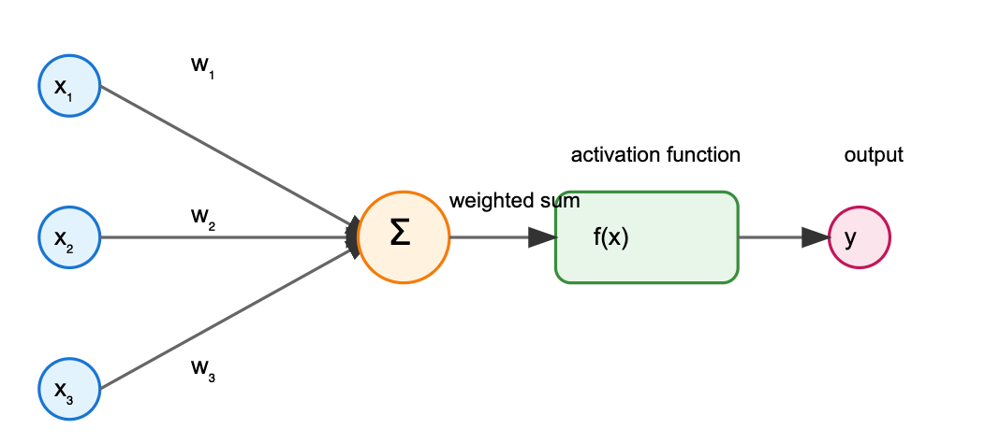
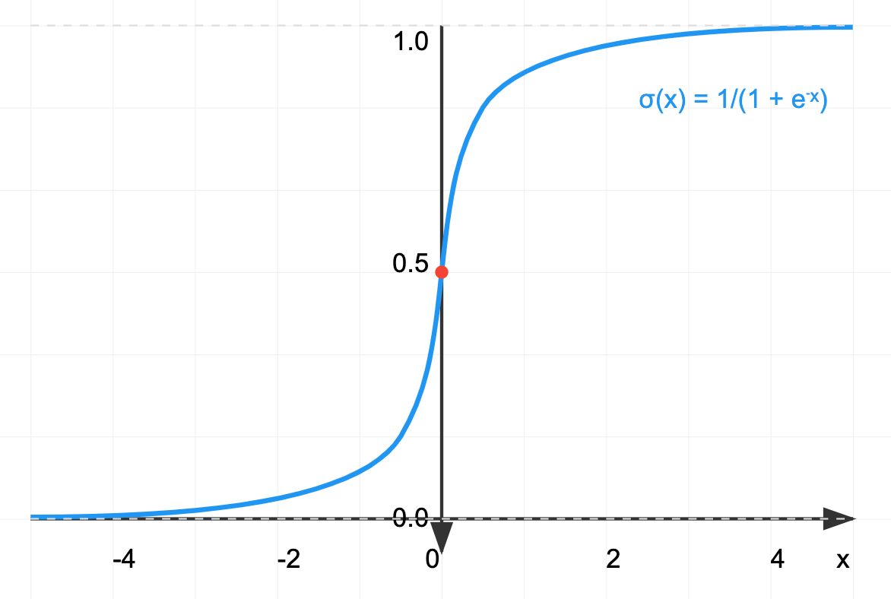
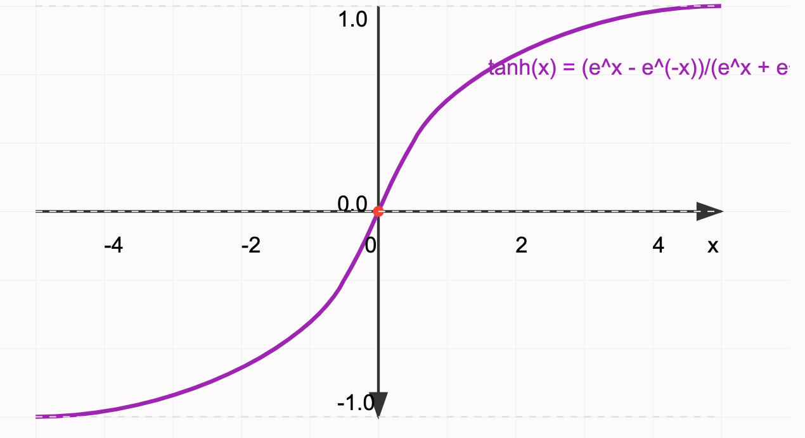
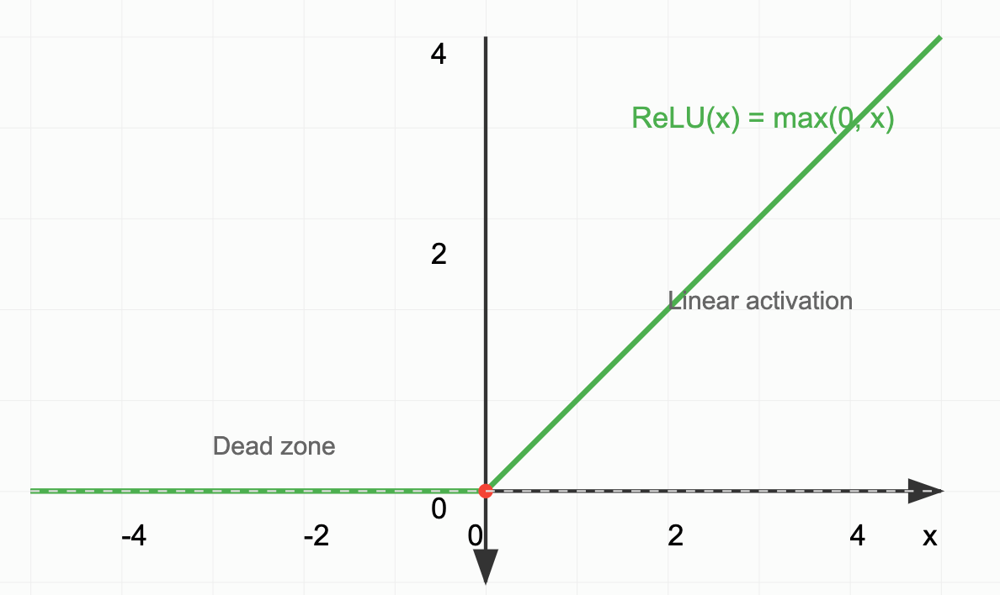
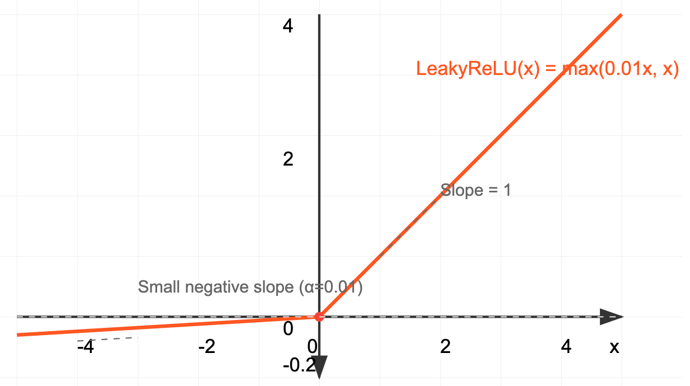
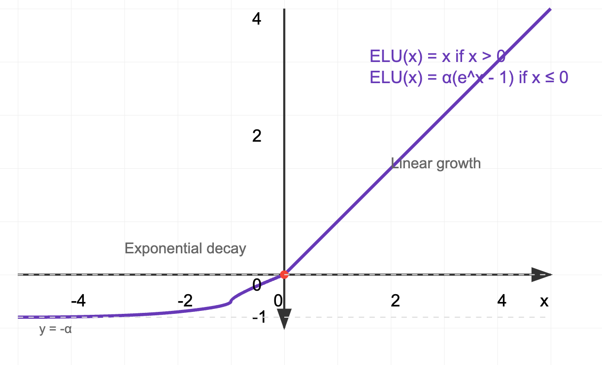
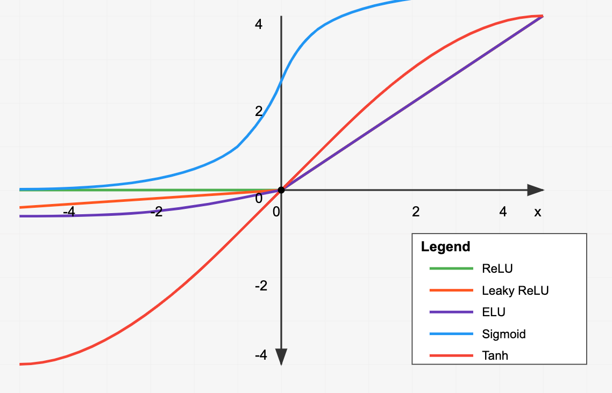

# Activation Functions in Deep Learning

## Introduction

Activation functions are mathematical equations that determine the output of a neural network. They are crucial components that introduce non-linearity into the network, allowing it to learn complex patterns and relationships in data. Without activation functions, neural networks would simply be a series of linear transformations, severely limiting their ability to solve complex problems.

<!--
 INSERT FIGURE 1: Basic neuron diagram showing input, weighted sum, activation function, and output]
 -->

## Core Concepts

The activation function takes the weighted sum of inputs and biases, then transforms this value into an output signal. This transformation serves several critical purposes:

1. Non-linearity: Enables the network to approximate complex functions
2. Output bounding: Many activation functions constrain outputs to specific ranges
3. Gradient properties: Influences how effectively the network can learn through backpropagation

## Common Activation Functions

### 1. Sigmoid (Logistic Function)

$$
f(x) = 1 / (1 + e^(-x))
$$

**Pros:**
- Outputs bounded between 0 and 1
- Smooth gradient
- Clear probability interpretation
- Historically significant

**Cons:**
- Suffers from vanishing gradient problem
- Output not zero-centered
- Computationally expensive (exponential function)
- Saturates and kills gradients

**Computational Cost:** High (requires exponential calculation)

### 2. Hyperbolic Tangent (tanh)

$$
f(x) = (e^x - e^(-x)) / (e^x + e^(-x))
$$

**Pros:**
- Zero-centered outputs (-1 to 1)
- Stronger gradients than sigmoid
- Often works better than sigmoid in practice

**Cons:**
- Still suffers from vanishing gradient
- Computationally expensive
- Saturates

**Computational Cost:** High (requires exponential calculations)

### 3. Rectified Linear Unit (ReLU)

$$
f(x) = max(0, x)
$$

**Pros:**
- Computationally efficient
- No vanishing gradient for positive values
- Sparse activation (natural regularization)
- Faster convergence
- Biologically inspired

**Cons:**
- "Dying ReLU" problem
- Not zero-centered
- Unbounded positive activation

**Computational Cost:** Very Low (simple max operation)

### 4. Leaky ReLU

$$
f(x) = max(αx, x), where α is typically 0.01
$$

**Pros:**
- Prevents dying ReLU problem
- All benefits of ReLU
- Allows for negative gradients

**Cons:**
- Results not consistent across problems
- Additional hyperparameter (α)
- Not zero-centered

**Computational Cost:** Very Low (simple max operation with scalar multiplication)

### 5. Exponential Linear Unit (ELU)

$$
f(x) = x if x > 0
f(x) = α(e^x - 1) if x ≤ 0
$$

**Pros:**
- Reduces bias shift
- Natural gradient
- Robust to noise
- Better handling of negative values

**Cons:**
- Computationally more expensive than ReLU
- Additional hyperparameter (α)
- Slightly more complex derivative

**Computational Cost:** Moderate (exponential calculation only for negative values)

## Computational Efficiency and Scale

When building large-scale deep learning models, the computational efficiency of activation functions becomes crucial. Here's a comparison of relative computational costs:

1. ReLU/Leaky ReLU: ~1x (baseline)
2. ELU: ~2-3x
3. Sigmoid/Tanh: ~4-5x

For a model with millions or billions of parameters, these differences can significantly impact:
- Training time
- Inference latency
- Energy consumption
- Hardware requirements

## Modern Usage Patterns

In contemporary deep learning practice, activation functions are typically chosen as follows:

1. **Default Choice: ReLU**
   - Used in ~80% of deep learning applications
   - Standard for most convolutional neural networks
   - Excellent balance of performance and efficiency

2. **Common Alternatives:**
   - Leaky ReLU: When dying ReLU is a concern
   - ELU: When negative values need better handling
   - Tanh: In RNNs and some specialized architectures

3. **Specific Use Cases:**
   - Sigmoid: Final layer of binary classification
   - Softmax: Final layer of multi-class classification
   - Linear: Final layer of regression tasks

## Conclusion

The choice of activation function can significantly impact both model performance and computational efficiency. While ReLU dominates modern architectures due to its simplicity and effectiveness, understanding the full range of options allows practitioners to make informed decisions based on their specific use cases and constraints.

For large-scale deep learning projects, the computational efficiency of ReLU makes it particularly attractive, as the activation function computation can represent a significant portion of the overall computational budget. However, practitioners should remain aware of potential issues like the dying ReLU problem and be prepared to switch to alternatives when necessary.

FIGURE 7: Comparative visualization of all activation functions discussed]

## Practice Questions

1. Why can't neural networks only use linear transformations without activation functions?
2. What makes ReLU computationally efficient compared to sigmoid and tanh?
3. In what scenarios might you choose ELU over ReLU despite its higher computational cost?
4. How does the choice of activation function impact the training of very deep networks?