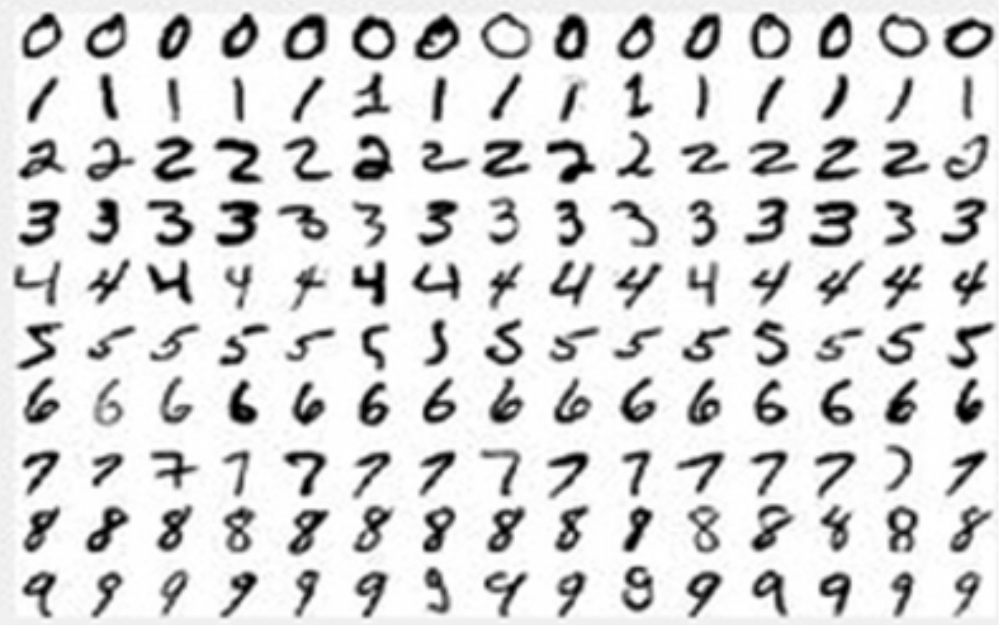
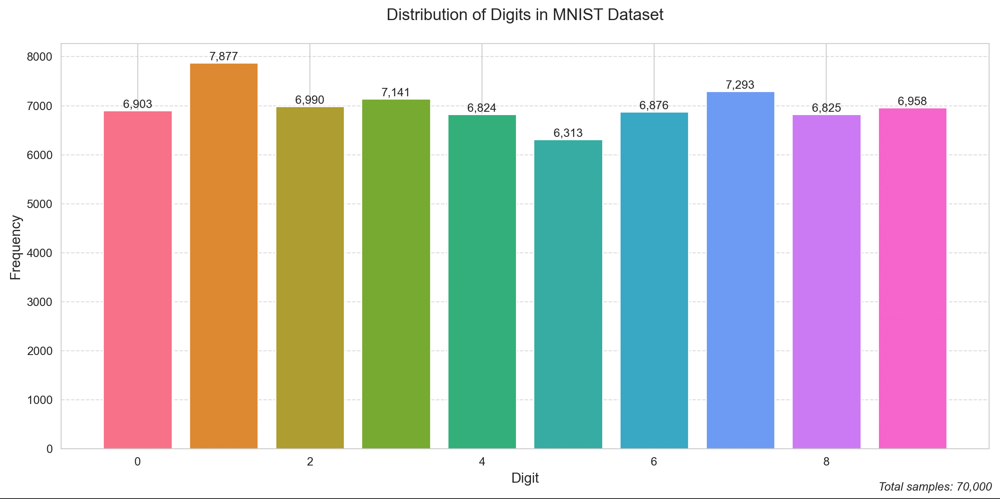
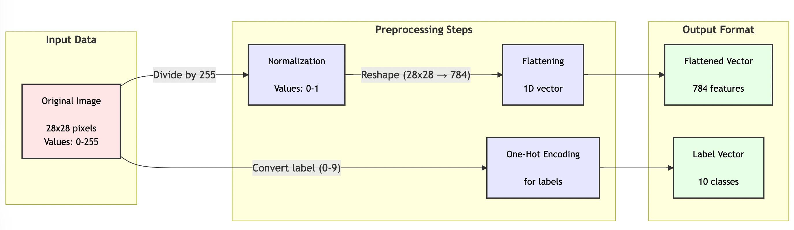
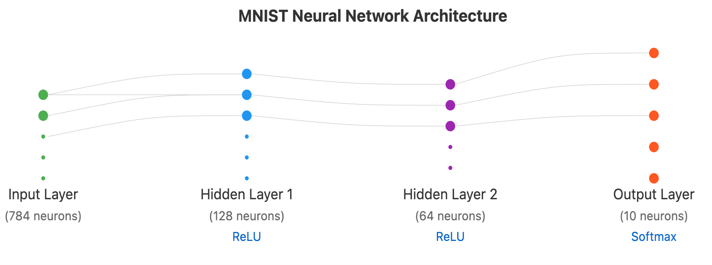

# MINST

The MNIST (Modified National Institute of Standards and Technology) dataset is the widely-used dataset of handwritten digits that serves as a standard 
benchmark for building and testing machine learning models,
particularly deep learning models. It contains 60,000 training images 
and 10,000 testing images of handwritten digits from 0-9, with each 
image being 28x28 pixels in grayscale. 

The MNIST dataset is often used as a "Hello World" project for getting 
started with deep learning and neural networks.

Here's a detailed walkthrough of building a deep learning model using the MNIST dataset:

**Project Title:** MNIST Handwritten Digit Classification<br/>
**Time Required:** 2-3 hours<br/>
**Difficulty Level:** Beginner-Intermediate<br/>

## Introduction

The MNIST project is a fundamental introduction to deep learning where we build a neural network to recognize handwritten digits. This project demonstrates core concepts like data preprocessing, model architecture, training, and evaluation.


Sample of MNIST images of grayscale digits (0-9)

## Prerequisites

- Python 3.x
- TensorFlow or PyTorch
- NumPy
- Matplotlib
- Basic understanding of neural networks

## Steps

### Step 1: Setup Conda Environment and Libs

1. Create a conda environment called "mnist" and activate it
1. Import the MNIST dataset through your chosen deep learning framework

Here is a sample UNIX shell script to setup your conda environment and load the appropriate python libraries.

```sh
conda deactivate
conda create --name mnist python=3.10
conda activate mnist
conda install matplotlib
conda install numpy
conda install seaborn
conda install scikit-learn
```

### Step 2: Data Profiling

[Data Profiling](../../glossary.md#data-profile) is the process of understanding what data you have as the distribution of data.  Having a good understanding of your input data is a key aspect to building a useful deep learning model.

Without going into too much detail, here is a summary of the MNIST dataset

The MNIST dataset contains:
   - 60,000 training images (28x28 pixels each)
   - 10,000 testing images
   - Labels from 0-9 for each image


Bar chart showing the distribution of digits in training set to demonstrate data balance
[Digit Distribution Python Code](01-distribution.py)

### Step 3: Data Preprocessing
1. Normalize pixel values from [0, 255] to [0, 1]
2. Reshape images from 28x28 to 784-dimensional vectors
3. Convert labels to [one-hot encoded format](../../glossary.md#one-hot-encoded-format)
4. Split training data into training and validation sets (80-20 split)

In MNIST digit classification, each target label (0-9) is encoded as a 10-dimensional binary vector: the digit '3' becomes [0,0,0,1,0,0,0,0,0,0], where only the fourth position (index 3) contains a 1.


MNIST Data preprocessing steps, showing original image → normalized image → flattened vector
[Mermaid Flowchart](./processing-steps.mermaid)

### Step 4: Model Architecture
Build a simple neural network with:

1. Input layer (784 neurons)
2. Hidden layer 1 (128 neurons, ReLU activation)
3. Hidden layer 2 (64 neurons, ReLU activation)
4. Output layer (10 neurons, softmax activation)


Network architecture diagram showing layers, connections, and dimensions.

### Step 5: Model Training

Configure training parameters:

- **Loss function:** Categorical cross entropy
- **Optimizer:** Adam
- **Learning rate:** 0.001
- **Batch size:** 32
- **Epochs:** 10

### Step 6: Train the model while monitoring:

- Training accuracy
- Validation accuracy
- Training loss
- Validation loss

[FIGURE DESCRIPTION: Two line plots showing training/validation accuracy and loss over epochs]

### Step 7: Model Evaluation

1. Evaluate model on test set
2. Generate confusion matrix
3. Calculate key metrics:
      1. Accuracy
      2. Precision
      3. Recall
      4. F1-score

[FIGURE DESCRIPTION: Confusion matrix heatmap showing prediction results across all digits]

### Step 8: Making Predictions
1. Select random test images
2. Make predictions
3. Display results with:
      - Original image
      - Predicted digit
      - Confidence score

[FIGURE DESCRIPTION: Grid of sample predictions showing original images, predicted digits, and confidence scores]

### Common Challenges and Solutions

1. Overfitting
      - Solution: Add dropout layers
      - Solution: Use data augmentation

2. Poor Convergence
      - Solution: Adjust learning rate
      - Solution: Modify batch size

3. Low Accuracy
      - Solution: Deepen network
      - Solution: Increase training time

### Tips for Improvement

1. Experiment with different architectures:
      - Convolutional Neural Networks (CNNs)
      - Different numbers of layers
      - Various activation functions

2. Try data augmentation:
      - Random rotations
      - Slight shifts
      - Small zooms

3. Implement regularization:
      - Dropout
      - L1/L2 regularization
      - Batch normalization

### Project Extensions

1. Build a web interface for real-time digit recognition
2. Implement different model architectures (CNN, ResNet)
3. Create a mobile app for digit recognition
4. Compare performance across different frameworks

[FIGURE DESCRIPTION: Comparison chart showing accuracy vs. complexity for different model architectures]

### Expected Results

- Training accuracy: >98%
- Test accuracy: >97%
- Training time: ~5 minutes on CPU
- Model size: ~5MB

This project serves as an excellent introduction to deep learning, covering essential concepts while providing a solid foundation for more complex projects. The visual nature of the problem makes it easy to understand and debug, while the relatively small dataset size allows for quick experimentation with different approaches.

## References

[Claude Transcript](https://claude.site/artifacts/2b24a601-5ff9-418d-a3a8-6e3388a1b6c9)