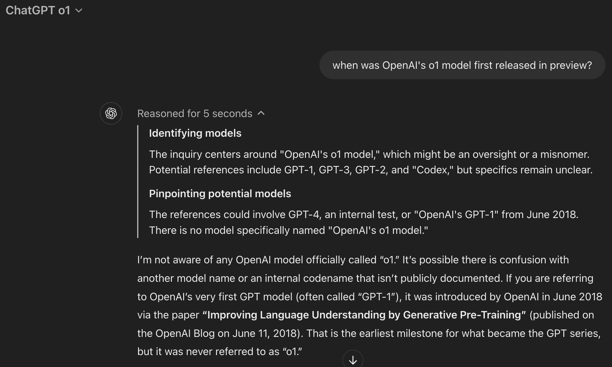

# Timeline of Deep Learning Events

!!! prompt
    You are an expert at the history of Deep Learning.
    Please create a timeline of the 100 most important events in the development of Deep Learning.
    Return the event list in a single HTML file that could be used by the vis-timeline JavaScript library.
    An example template is shown below.

```html
<!doctype html>
<html>
<head>
  <title>Timeline</title>
  <script type="text/javascript" src="https://unpkg.com/vis-timeline@latest/standalone/umd/vis-timeline-graph2d.min.js"></script>
  <link href="https://unpkg.com/vis-timeline@latest/styles/vis-timeline-graph2d.min.css" rel="stylesheet" type="text/css" />
  <style type="text/css">
    #visualization {
      width: 600px;
      height: 400px;
      border: 1px solid lightgray;
    }
  </style>
</head>
<body>
<div id="visualization"></div>
<script type="text/javascript">
  // DOM element where the Timeline will be attached
  var container = document.getElementById('visualization');

  // Create a DataSet (allows two way data-binding)
  var items = new vis.DataSet([
    {id: 1, content: 'item 1', start: '2014-04-20'},
    {id: 2, content: 'item 2', start: '2014-04-14'},
    {id: 3, content: 'item 3', start: '2014-04-18'},
    {id: 4, content: 'item 4', start: '2014-04-16', end: '2014-04-19'},
    {id: 5, content: 'item 5', start: '2014-04-25'},
    {id: 6, content: 'item 6', start: '2014-04-27', type: 'point'}
  ]);

  // Configuration for the Timeline
  var options = {};

  // Create a Timeline
  var timeline = new vis.Timeline(container, items, options);
</script>
</body>
</html>
```

### Workflow for Initial Prompt

ChatGPT o1 thought about Deep Learning history timeline for 38 seconds

**Mapping evolution**

I'm tasked with crafting a timeline of 100 key deep learning events from 1943 to today. This involves producing a comprehensive HTML file using the vis-timeline library, ensuring clarity and segmentation in line with the provided example.

**Highlighting foundational events**

I'm mapping out key milestones in deep learning, including McCulloch & Pitts in 1943, Donald Hebb's learning rule in 1949, and diverse breakthroughs through to 2023.

**Charting milestones**

I'm noting pivotal moments in deep learning, including the birth of AI in 1956 and Rosenblatt's perceptron in 1957. Progress continues through diverse breakthroughs up to 2023.

**Tracking key milestones**

I'm updating the timeline with significant events such as McCulloch & Pitts in 1943, the Turing test in 1950, and Rosenblatt's perceptron in 1957, organizing them chronologically by year.

**Tracking deep learning strides**

Mapping out milestones like Minsky & Papert's "Perceptrons" in 1969, the AI winter in the 1970s, and transformative advances like "AlphaGo" and BERT from 2016 onwards.

**Mapping key developments**

I'm laying out pivotal milestones in deep learning, like McCulloch & Pitts' model in 1943, Donald Hebb's learning rule in 1949, and breakthroughs such as transformers from 2017 onwards.

**Charting progress**

Mapping significant developments in neural networks, like the Neocognitron's introduction as a precursor to convolutional neural nets in 1979, and the formalization of Hopfield networks for associative memory in 1981.

**Advancing neural network training**

Highlighting the creation and application of backpropagation, neural network training techniques, and landmark publications like "Parallel Distributed Processing" and LeCun's work on convolutional neural networks.

**Tracking breakthroughs**

I'm noting critical advancements like IBM's Deep Blue in 1997, the introduction of LSTM networks, and the availability of GPU programming for computations, which significantly influenced AI research and applications.

**Tracing key milestones**

I'm noting the development of deep learning technologies like AlexNet's breakthrough on ImageNet, the emergence of GANs, and the progression of neural machine translation, which have all significantly advanced AI capabilities.

**Charting AI evolution**

I'm tracking the progression of AI, showcasing milestones like the introduction of transformers, GPT-3's launch, and the significant advancement of text-to-image generation technologies.

**Tracking milestones**

I'm organizing AI milestones for each year, ensuring concise and consistent entries, and wrapping them in HTML with specific formatting. Progress is being made step by step.

## Result

[Deep Learning Timeline MicroSim](../sims/timeline/index.md)

## Reading Timeline Data from a JSON File

!!! prompt
  Rewrite the program to read the timeline data from a JSON file.

### Workflow

**Thinking through options**

I'm analyzing how to fetch data from an external JSON file into a vis-timeline. Using a fetch request will streamline the process by pulling the data from the file and then updating the timeline.

**Naming and consistency**

I'm keeping the code name and timeline config intact, specifying the JSON file format, and using fetch to pull in data and update the timeline with a single snippet.

Below is an example of how you might restructure your HTML/JavaScript so that the timeline data comes from a separate JSON file named `items.json`. Make sure the `items.json` file is located in the same directory as your HTML page (or update the `fetch` path accordingly).

```python
<!doctype html>
<html>
<head>
  <title>Deep Learning Timeline (1935-2025)</title>
  <script type="text/javascript" src="https://unpkg.com/vis-timeline@latest/standalone/umd/vis-timeline-graph2d.min.js"></script>
  <link href="https://unpkg.com/vis-timeline@latest/styles/vis-timeline-graph2d.min.css" rel="stylesheet" type="text/css" />
  <style type="text/css">
    #visualization {
      width: 90%;
      height: 600px;
      border: 1px solid lightgray;
      margin: 0 auto;
    }
    body {
      font-family: Arial, sans-serif;
      margin: 20px;
    }
    h1 {
      text-align: center;
    }
  </style>
</head>
<body>
<h1>Key Events in Deep Learning History (1935-2025)</h1>
<div id="visualization"></div>

<script type="text/javascript">
  // DOM element where the Timeline will be attached
  var container = document.getElementById('visualization');

  // Fetch timeline data from external JSON file
  fetch('items.json')
    .then(response => response.json())
    .then(data => {
      // Create a DataSet (allows two way data-binding) using the fetched data
      var items = new vis.DataSet(data);

      // Configuration for the Timeline
      var options = {
        // Restrict the timeline's visible window (and scrolling) to 1935 - 2025
        min: "1935-01-01",
        max: "2025-12-31",
        start: "1935-01-01",
        end: "2025-12-31",
        stack: true,
        maxHeight: '90%',
        minHeight: '300px',
        margin: {
          item: 10,
          axis: 10
        }
      };

      // Create and render the Timeline
      var timeline = new vis.Timeline(container, items, options);
    })
    .catch(error => {
      console.error('Error loading timeline data:', error);
    });
</script>
</body>
</html>
```

## OpenAI o1 is not Self Aware

