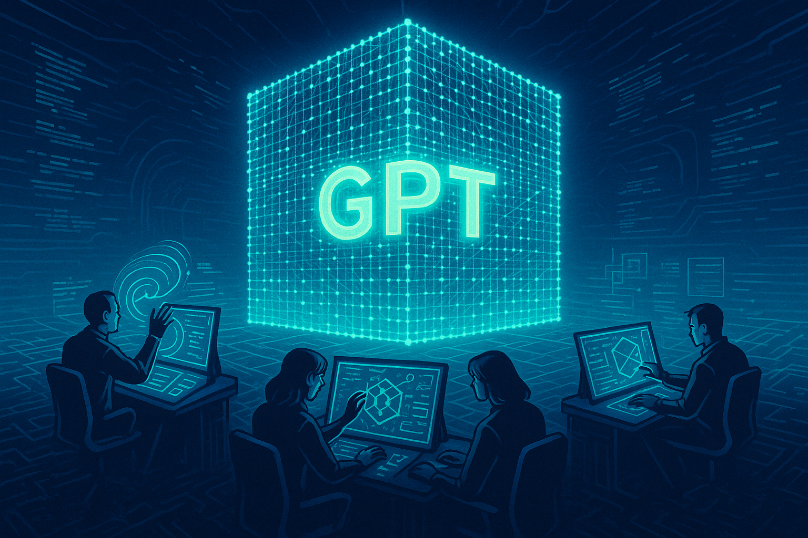
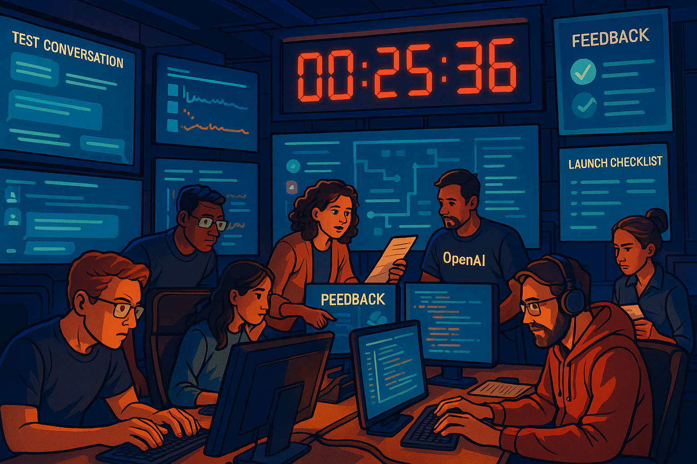
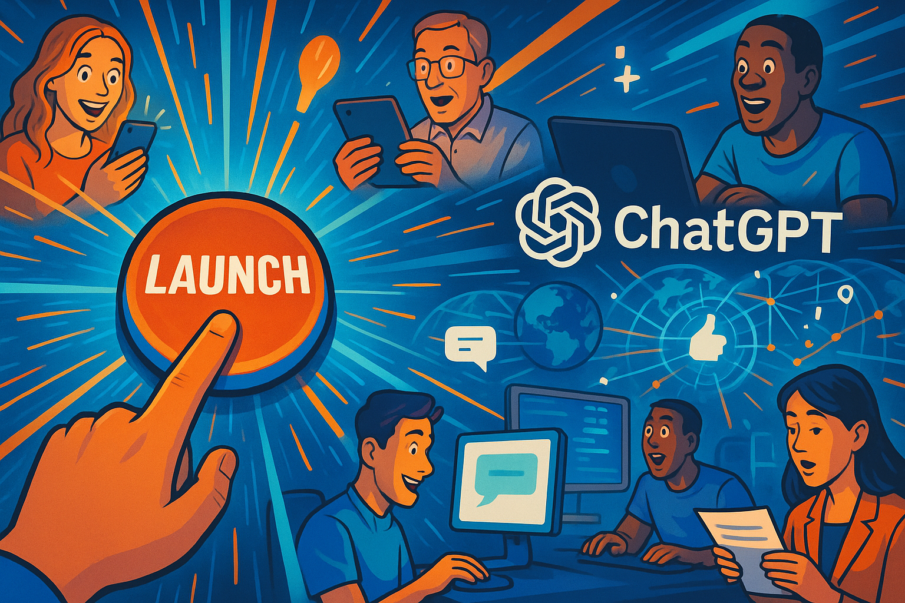
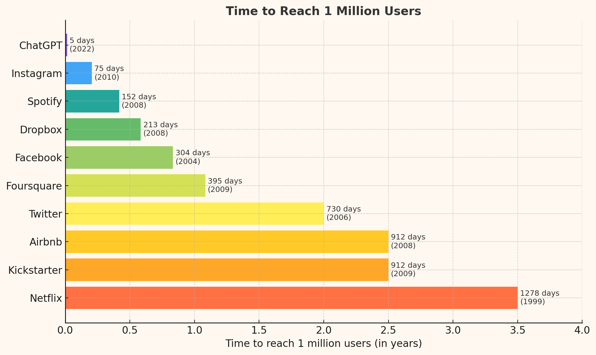
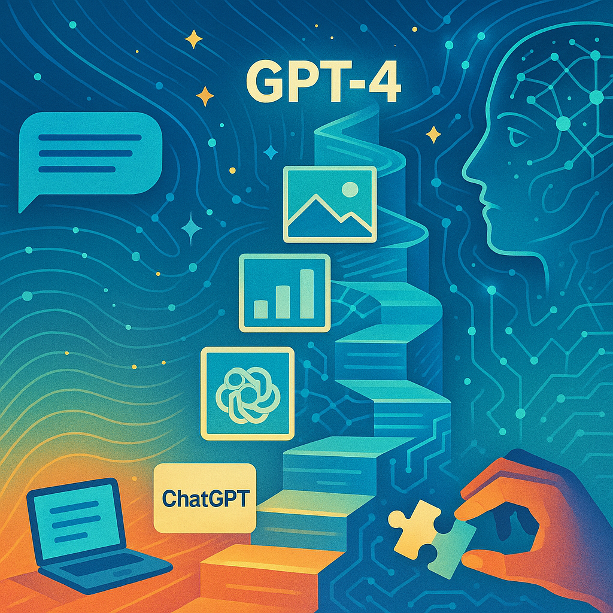
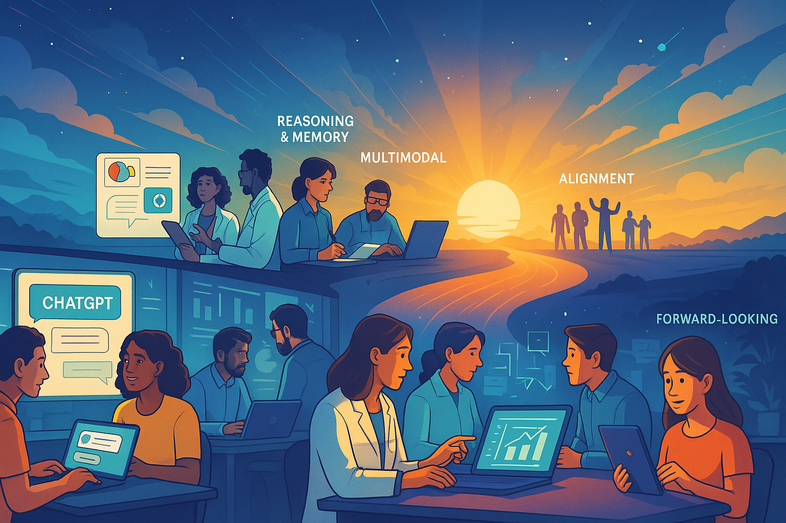
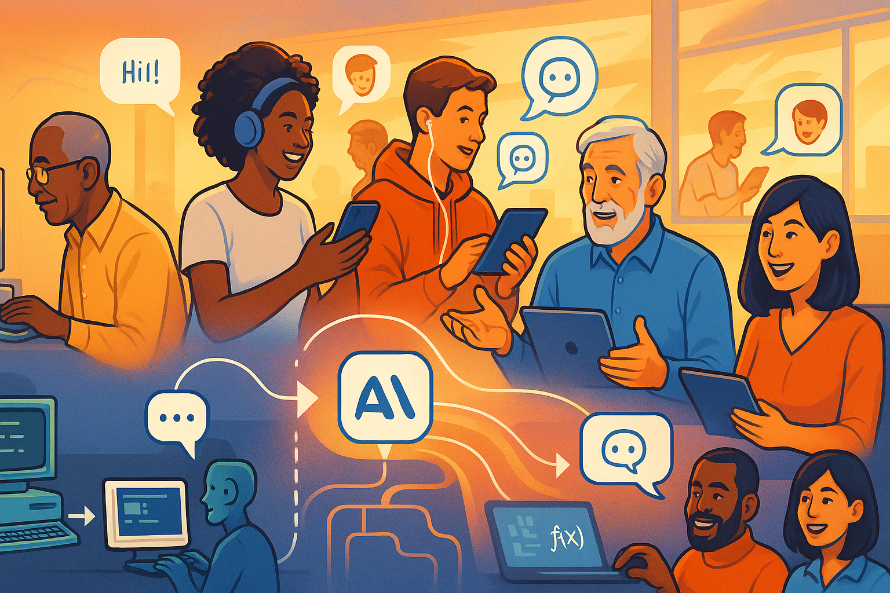

# Dawn of the Conversation Revolution: The ChatGPT Story

<details class="show-prompt">
  <summary>Show Narrative Prompt</summary>
Given to Anthropic Claud 3.7 in the context of the Deep Learning course project.  Please create a detailed, fun and entertaining story about the launch of the OpenAI product ChatGPT and its relevance to the rise of AI technologies.

Our goal is to have you generate the full text of the story, but to turn the story into a graphic novel with many illustrations that explain how the product ChatGPT was created.  Describe the challenges the team had and how they overcame these challenges.

When appropriate, suggest an image that could be inserted into the story to make the story a graphic novel. Describe each image in detail and be consistent across all the images in the story for style.  When you describe an image, make sure to mention that it should be a colorful, bright wide-landscape drawing suitable for technology-forward optimistic graphic-novel.  All image prompts were given to OpenAI 4o.
</details>

## Chapter 1: Seeds of Innovation


<details>
  <summary>Show Image Prompt</summary>
  1: A colorful, bright wide-landscape drawing showing San Francisco skyline with the OpenAI office building prominently featured. A diverse group of researchers and engineers are gathered around a whiteboard filled with neural network diagrams. The art style should be vibrant and optimistic, with a tech-forward aesthetic reminiscent of modern graphic novels. Stylized light bulbs float above their heads, representing the moment of inspiration.
</details>

In the heart of San Francisco, a team of visionaries at OpenAI had been pushing the boundaries of artificial intelligence for years. Founded in 2015 with the mission to ensure that artificial general intelligence benefits all of humanity, OpenAI had already made significant contributions to the field with models like GPT-1 and GPT-2.

But by early 2022, the team was ready to take on a bigger challenge—creating an AI assistant that could have natural, helpful conversations with humans across an unprecedented range of topics. The groundwork had been laid with GPT-3, released in 2020, which demonstrated remarkable language capabilities but still lacked the refinement needed for a truly conversational AI.

## Chapter 2: Building the Foundation

  <details><summary>Show Image Prompt</summary>
  2: A colorful, bright wide-landscape drawing depicting a massive digital architecture floating in a stylized cyberspace. The GPT architecture is visualized as an enormous glowing structure with billions of interconnected nodes. Engineers in futuristic workstations appear to be sculpting parts of this architecture, with holographic code surrounding them. The image should convey both scale and precision, with a sense of awe at the magnitude of the project. The color palette should feature deep blues and bright teals, signature colors of AI visualization.
  </details>

The journey to ChatGPT began with GPT-3.5, a model trained on an enormous dataset of text from the internet. The scale was staggering—hundreds of billions of parameters, trained on trillions of words. The compute resources required were immense, necessitating specialized infrastructure and optimization techniques.

"We needed to build a model that could not only generate coherent text but understand context, follow instructions, admit its mistakes, and challenge incorrect premises," explained one team member. "This required both advances in the underlying technology and new approaches to alignment with human values."

The team faced numerous technical challenges: how to make the model helpful without being harmful, truthful without being manipulative, and versatile without losing coherence. They experimented with various training methodologies, pushing the boundaries of what was possible.

## Chapter 3: The Human Touch: RLHF

  <details><summary>Show Narrative Prompt</summary>
  Please generate another drawing.
  3: A colorful, bright wide-landscape drawing showing a split scene. On the left, human trainers are providing feedback to AI responses on sleek monitors. On the right, this feedback is visualized as flowing into a reinforcement learning system, represented by a maze-like structure where AI agents learn to navigate towards positive outcomes. The style should be dynamic and educational, with visual metaphors like thumbs-up symbols transforming into neural pathways. The color scheme should incorporate warm human tones contrasting with cool AI blues, symbolizing the human-AI collaboration.
  </details>

The breakthrough came with a technique called Reinforcement Learning from Human Feedback (RLHF). Rather than simply training the model on text prediction, the team trained it to align with human preferences.

"We would generate multiple responses from the model, then have human trainers rank them," recalled one researcher. "This feedback was used to train a reward model, which in turn guided the AI to generate more helpful, truthful, and harmless responses."

The process was iterative and labor-intensive. Human trainers spent countless hours providing feedback, carefully evaluating responses for accuracy, helpfulness, potential harms, and alignment with instructions. Each iteration brought improvements, gradually shaping the system toward more human-aligned behavior.

This human-in-the-loop approach represented a significant shift in AI development—acknowledging that pure data-driven approaches weren't enough to create AI systems that truly served human needs.

## Chapter 4: The Final Sprint

  <details><summary>Show Image Prompt</summary>
Please generate another drawing.

4: A colorful, bright wide-landscape drawing depicting an intense but energetic "war room" scenario. The OpenAI team is shown in the final weeks before launch, surrounded by multiple screens showing test conversations, metrics, and countdown timers. Some team members are debugging issues, others are reviewing feedback, while others are preparing launch materials. The atmosphere should convey productive tension and excitement. The art style should use dramatic lighting with the glow of screens illuminating determined faces, creating a sense of momentous anticipation.
</details>

As November 2022 approached, the pace intensified. The team worked around the clock, fixing bugs, addressing edge cases, and fine-tuning the system's capabilities. Testing revealed both impressive capabilities and concerning limitations.

"We discovered it could write poetry, explain complex scientific concepts, and help debug code—but it could also make up facts or produce harmful content if prompted in certain ways," noted one engineer. "We needed guardrails without making the system too restricted to be useful."

The team implemented numerous safety measures, built monitoring systems, and prepared for a research preview—a limited release that would allow them to gather real-world feedback while maintaining the ability to make improvements.

"We knew it wasn't perfect," said one team member. "But we also knew that getting it into people's hands was the best way to understand its real-world impact and continue improving."

## Chapter 5: The Launch That Broke the Internet

  <details>
  <summary>Show Image Prompt</summary>
    Please generate another drawing.
5: A colorful, bright wide-landscape drawing showing the moment of ChatGPT's launch. The central image shows a stylized "launch button" being pressed, with digital energy radiating outward. Around this central action, show a montage of people from diverse backgrounds and professions discovering and using ChatGPT for the first time, with expressions of amazement. Include visualizations of server load metrics spiking dramatically and social media reaction spreading virally across the globe. The style should be vibrant and kinetic, capturing the explosive moment when ChatGPT captured worldwide attention.
</details>

On November 30, 2022, OpenAI released ChatGPT as a research preview. What happened next exceeded everyone's expectations.


<details>
   <summary>Show Image Prompt</summary>
   Please regenerate this chart using the color theme of the other images in this story.

   ```python
   import matplotlib.pyplot as plt

# Data from the image
products = [
    "Netflix", "Kickstarter", "Airbnb", "Twitter", "Foursquare",
    "Facebook", "Dropbox", "Spotify", "Instagram", "ChatGPT"
]
years = [1999, 2009, 2008, 2006, 2009, 2004, 2008, 2008, 2010, 2022]
times = [3.5, 2.5, 2.5, 2, 13/12, 10/12, 7/12, 5/12, 75/365, 5/365]  # Time to 1M users in years

# Colors to match the style from earlier AI impact visuals: warm gradient at bottom to cool at top
colors = [
    "#ff7043", "#ffa726", "#ffca28", "#ffee58", "#d4e157",
    "#9ccc65", "#66bb6a", "#26a69a", "#42a5f5", "#7e57c2"
][::-1]  # reverse to match data order from bottom up

fig, ax = plt.subplots(figsize=(10, 6))
bars = ax.barh(products[::-1], times[::-1], color=colors)

# Annotations
for bar, time, year in zip(bars, times[::-1], years[::-1]):
    ax.text(bar.get_width() + 0.02, bar.get_y() + bar.get_height()/2,
            f"{round(time*365)} days\n({year})", va='center', fontsize=9)

# Styling
ax.set_xlabel("Time to reach 1 million users (in years)")
ax.set_title("Time to Reach 1 Million Users", fontsize=14, fontweight='bold')
ax.set_xlim(0, 4)
ax.invert_yaxis()
ax.grid(axis='x', linestyle='--', alpha=0.6)
ax.set_facecolor('#fff8f0')
fig.patch.set_facecolor('#fff8f0')

plt.tight_layout()
plt.savefig("/mnt/data/time_to_1_million_users_redraw.png", dpi=300)
plt.show()
```
</details>

Within five days, ChatGPT had over one million users. Social media exploded with examples of its capabilities—writing essays, creating poetry, explaining complex topics, drafting emails, and more. The servers struggled under the unprecedented demand, frequently showing capacity messages to new users.

"We expected interest, but nothing like what we saw," recalled one team member. "It was simultaneously exhilarating and terrifying. We'd created something that resonated with people in a way no previous AI system had."

Unlike previous AI models that had primarily interested researchers and specialists, ChatGPT captured the public imagination. People were using it for homework help, creative writing, coding assistance, trip planning, and countless other applications the team hadn't anticipated.

## Chapter 6: The Response and Ripple Effects

<details><summary>Show Image Prompt</summary>
    Please generate another drawing.
6: A colorful, bright wide-landscape drawing illustrating the wide-ranging impact of ChatGPT across society. The image should be divided into sections showing different sectors: education (students and teachers using AI), business (startups forming around the technology), media (journalists reporting on the phenomenon), and competition (other tech companies rushing to develop rival models). In the center, show ChatGPT as a ripple effect emanating outward. The style should be information-rich but visually cohesive, with a clean modern aesthetic that conveys how the technology is integrating into everyday life.
</details>

The response to ChatGPT was swift and far-reaching. Investors poured money into AI startups. Established tech companies accelerated their own conversational AI projects. Schools and universities grappled with how to adapt their teaching and assessment methods. Businesses began exploring how to integrate the technology into their operations.

Within months, Microsoft had invested billions in OpenAI and begun integrating ChatGPT technology into its Bing search engine and other products. Google declared a "code red" and rushed to release its own conversational AI, Bard. The AI arms race had begun in earnest.

But alongside the excitement came concerns and criticisms. Some worried about AI's impact on jobs, particularly in creative and knowledge work. Others pointed out the model's tendency to present incorrect information confidently—a problem dubbed "hallucination." Privacy advocates raised questions about the data used to train these systems.

The OpenAI team worked to address these concerns while continuing to improve the system. In January 2023, they announced ChatGPT Plus, a subscription service offering reliable access, faster responses, and priority access to new features.

## Chapter 7: GPT-4 Raises the Bar

  <details><summary>Show Image Prompt</summary>
    Please generate another drawing.
7: A colorful, bright wide-landscape drawing showing the evolution from ChatGPT to GPT-4. Visualize this as an ascending staircase or spiral of capability, with each step representing a significant improvement. Show GPT-4 handling multiple types of content - text, images, charts, and complex problems. Include visual representations of GPT-4's improved reasoning abilities, showing it solving complex puzzles or analyzing visual information. The art style should emphasize evolution and advancement, with increasingly sophisticated patterns as the eye moves upward through the image.
</details>

In March 2023, OpenAI unveiled GPT-4, a significantly more advanced model that powered the next generation of ChatGPT. The improvements were substantial—GPT-4 was more accurate, could handle more nuanced instructions, had expanded knowledge, and demonstrated improved reasoning abilities.

Perhaps most significantly, GPT-4 introduced multimodal capabilities, allowing it to accept images as inputs alongside text. This opened up new possibilities—users could upload charts for analysis, documents for summarization, or photos for identification and explanation.

"With GPT-4, we were getting closer to an AI assistant that could truly complement human capabilities across a wide range of tasks," explained one researcher. "It still had limitations, but the gap between AI and human performance on many cognitive tasks was narrowing faster than many had predicted."

The advancement from ChatGPT to GPT-4 in just a few months demonstrated the rapid pace of progress in AI capabilities—and hinted at what might be possible in the coming years.

## Chapter 8: A New Computing Paradigm

  <details><summary>Show Image Prompt</summary>
    Please generate another drawing.
8: A colorful, bright wide-landscape drawing depicting the integration of AI assistants into everyday life and work. Show people from diverse backgrounds and professions collaborating with AI across devices and contexts: architects reviewing designs with AI input, doctors discussing diagnoses, students learning concepts, programmers coding with assistance, and everyday people having conversations with AI assistants. The image should convey a sense of harmonious partnership between humans and AI. The style should be forward-looking but grounded, showing realistic applications rather than far-future fantasy.
</details>

By mid-2023, it was clear that ChatGPT wasn't just another tech product—it represented the beginning of a new computing paradigm. The conversation-based interface made advanced AI capabilities accessible to anyone who could express their needs in natural language, without requiring specialized knowledge or training.

The impact was particularly profound for software development. GPT-4 could generate functional code from natural language descriptions, debug existing code, explain programming concepts, and suggest improvements—democratizing programming abilities that previously required years of study.

In education, despite initial concerns about cheating, many educators began incorporating AI assistants into their teaching methods, recognizing that the ability to effectively collaborate with AI would be an essential skill for their students' futures.

"We're entering an era where the boundary between human and machine intelligence is becoming more fluid," observed one AI researcher. "It's not about AI replacing humans, but about finding the right ways for humans and AI to collaborate—combining the creativity, judgment, and ethical reasoning of humans with the pattern recognition, memory, and processing capabilities of AI."

## Chapter 9: The Road Ahead

  <details><summary>Show Image Prompt</summary>
Please generate another drawing.
9: A colorful, bright wide-landscape drawing showing the future horizon of AI development. The foreground should show current applications of ChatGPT and similar technologies. The middle ground shows researchers working on next-generation capabilities and addressing current limitations. The background depicts a bright horizon with silhouettes of possibilities: AI systems that can reason over long periods, incorporate diverse modalities, and operate with greater autonomy while maintaining alignment with human values. The art style should be inspirational and forward-looking, using light and perspective to draw the eye toward future possibilities.
</details>

The story of ChatGPT is far from over. As OpenAI and other organizations continue to develop more capable AI systems, both the opportunities and challenges will grow.

Technical challenges remain—improving reasoning abilities, reducing hallucinations, enabling AI systems to better understand human values and nuances, and finding ways to ground models in verified information rather than generating plausible-sounding falsehoods.

Broader societal questions are equally important—how to ensure these powerful technologies benefit humanity broadly rather than concentrating power, how to adapt education and work for an AI-enabled world, and how to develop appropriate governance frameworks for increasingly capable AI systems.

"ChatGPT showed us that AI capabilities can progress more rapidly than expected, and can have impacts that ripple throughout society," reflected one OpenAI researcher. "That makes our mission—ensuring that artificial general intelligence benefits all of humanity—more important than ever."

## Epilogue: The Conversation Revolution

  <details><summary>Show Image Prompt</summary>

    Please generate another drawing.
10: A colorful, bright wide-landscape drawing showing a diverse group of people engaged in various conversations with AI assistants across different devices and settings. The image should show both current applications and hint at future possibilities. Include a subtle visual element showing the progression from early computers and command-line interfaces to the natural language paradigm of ChatGPT, emphasizing how this represents a fundamental shift in human-computer interaction. The style should be reflective yet optimistic, with warm lighting suggesting a new dawn in computing history.
</details>

In less than a year, ChatGPT transformed from a research project to a cultural phenomenon that changed how millions of people think about artificial intelligence. It made the abstract concept of AI tangible and personal—something people could interact with directly, form opinions about, and incorporate into their daily lives.

Perhaps most significantly, it opened a global conversation about AI's role in society. No longer the realm of specialists, debates about AI capabilities, risks, benefits, and governance became mainstream topics. Millions of people who had never thought much about AI before were now experiencing it directly and forming their own views.

As one OpenAI team member put it: "The launch of ChatGPT didn't just change AI—it changed the conversation about AI. And that conversation, involving diverse perspectives from around the world, is essential as we navigate the development of increasingly capable AI systems."

The story of ChatGPT reminds us that technology doesn't develop in isolation—it's shaped by human choices, values, and feedback. As AI capabilities continue to advance, the conversation between humans and AI—and among humans about AI—will remain essential to ensuring these powerful technologies serve humanity's best interests.

## References

* [The inside story of how ChatGPT was built from the people who made it](https://www.technologyreview.com/2023/03/03/1069311/inside-story-oral-history-how-chatgpt-built-openai/)
Exclusive conversations that take us behind the scenes of a cultural phenomenon. By Will Douglas Heaven - MIT Review - March 3, 2023