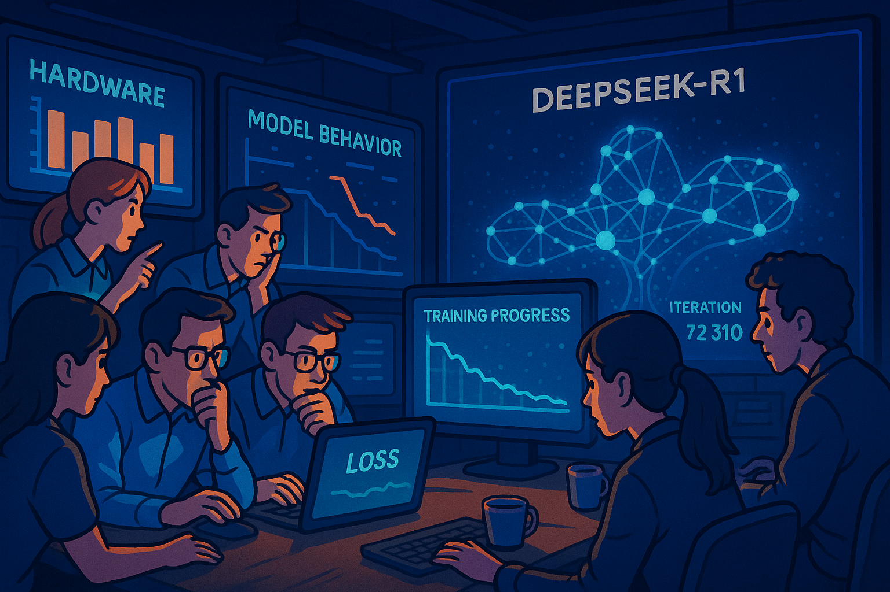

# DeepSeek-R1: The Efficient Revolution

  
Show Narrative Prompt

Please create a detailed, fun and entertaining story about the creation of the large language model called "DeepSeek-R1" and its relevance to the rise of open, small and low-cost LLMs. 

Describe the challenges and costs the team had building DeepSeek-R1 and how they cleverly use Reinforcement Learning, reasoning, and mixture-of-experts to create a high-quality language-model at a lower cost than other organizations.

Describe how with the lack of GPUs the team had to use resources carefully to get good results.

Describe the challenges the team faced and how they overcame these challenges. 

Discuss the tradeoffs that the company faced and how by using good software engineering they avoided having to use the "Brute Force" approach with massive GPU data centers.

Discuss how the DeepSeek architecture allows even smaller commercial grade gaming GPUs to achieve excellent inference performance due to the innovations in GPUs.

Describe how an entire intelligent-textbook for a college-level AI course can now be generated on a local GPU using DeepSeek-R1.

Our goal is to have you generate the full text of the story, but to turn the story into a graphic novel with many illustrations that explain how the Deepseek R1 product was created. 

When appropriate, suggest an image that could be inserted into the story to make the story a graphic novel. Describe each image in detail and be consistent across all the images in the story for style.  When you describe an image, make sure to mention that it should be a colorful, bright wide-landscape drawing suitable for technology-forward optimistic graphic-novel.

## Chapter 1: A Vision Against the Tide

In the sprawling landscape of AI development, where the biggest players raced to build ever-larger language models with seemingly unlimited resources, a small team at DeepSeek saw a different path forward. While giants like OpenAI and Anthropic were building models requiring thousands of GPUs and hundreds of millions in funding, the DeepSeek team believed they could create something just as powerful, but far more efficient.

Show Image Prompt

1: "The Vision" - A colorful, bright wide-landscape drawing showing the DeepSeek team gathered around a small cluster of computers in a modest office, while in the background through floor-to-ceiling windows, massive data centers from larger companies loom on the horizon. The contrast between the small, focused team and the industrial-scale operations behind them creates visual tension. The team members are shown in determined poses, examining holographic projections of neural network architectures that appear more elegant and streamlined than the bulky representations of competitor models floating in the background.

"We don't need to build the biggest model," said Lin Xiao, DeepSeek's lead architect. "We need to build the smartest model. One that can do more with less."

The team's vision was radical in its simplicity: create a high-quality language model that could run efficiently on consumer hardware. Not just for inference, but potentially even for fine-tuning. A model that would democratize AI by making it accessible to researchers, developers, and enthusiasts without enterprise-grade infrastructure.

## Chapter 2: The Resource Challenge

The challenge was daunting. The team had a fraction of the compute resources available to larger labs. While companies like Google and Microsoft had tens of thousands of GPUs at their disposal, DeepSeek had to make every bit of compute count.

Show Image Prompt

2: "Resource Management" - A colorful, bright wide-landscape drawing depicting the DeepSeek team in a war-room style setting. Large screens show resource allocation graphs and optimization metrics. Team members are strategically moving virtual computing resources represented as glowing blocks between different stages of the model development pipeline. Some blocks are being carefully examined, optimized, and then placed back into the workflow. The scene conveys the precision and thoughtfulness required when working with limited resources, with a prominent digital counter showing "GPU Hours Remaining" to emphasize the constraints they faced.

"When you can't win with brute force, you have to be clever," explained Zhang Wei, DeepSeek's training optimization lead. "Every hour of compute had to yield maximum benefit. We couldn't afford to run experiments just to see what happens."

The team implemented a rigorous experimental design process. Before any code was run on GPUs, it was extensively simulated and tested. Ideas were thoroughly vetted through theoretical analysis and small-scale experiments before graduating to larger runs.

While other companies could afford to train dozens of variants of their models to find the best performer, DeepSeek needed to get things right the first time.

## Chapter 3: Architecture Innovation - The MoE Breakthrough

The breakthrough came through an innovative application of the Mixture of Experts (MoE) architecture. Rather than making the entire model larger, they created a model where different "expert" neural networks specialized in different types of knowledge and reasoning.

Show Image Prompt

3: "The MoE Architecture" - A colorful, bright wide-landscape drawing showing a visualization of the DeepSeek-R1 architecture. The image depicts neural pathways flowing through a central router that dynamically directs queries to specialized expert modules represented as distinct colored nodes. Each expert is shown handling different types of information - one processing mathematical equations, another analyzing images, another working with code, etc. The architecture is depicted as an elegant, efficient machine with minimal wasted connections and maximum information flow. Small human figures are shown "training" each expert, emphasizing the human guidance in developing these specialized modules.

"Traditional models activate all their parameters for every token they process," explained Dr. Mei Chen, DeepSeek's chief scientist. "It's incredibly wasteful. Our MoE architecture only activates the parts of the model that are relevant to the current task."

This approach allowed DeepSeek-R1 to have the effective capacity of a much larger model while requiring significantly less compute resources. The router component of the architecture, which determined which experts to activate, became a critical focus of the team's research.

"The router is like an intelligent traffic controller," said Chen. "It needs to understand the query deeply enough to direct it to the right experts, but it can't be so complex that it negates our efficiency gains."

After months of experimentation, the team developed a multi-headed routing mechanism that could effectively distribute work across specialized expert neural networks, allowing for both broad knowledge and deep reasoning with remarkable efficiency.

## Chapter 4: The Training Strategy: Quality Over Quantity

While competitors were scaling up their datasets to trillions of tokens, the DeepSeek team took a different approach: they focused on data quality and training methodology rather than sheer volume.

Show Image Prompt

4: "Curated Learning" - A colorful, bright wide-landscape drawing showing the data curation process. The scene depicts team members carefully selecting and processing training data, visualized as glowing documents passing through various quality filters. Some researchers are shown enhancing particularly valuable datasets, which glow brighter as they receive special attention. In contrast to the "data firehose" approach shown in the background (representing competitors), the DeepSeek method is shown as a precise, surgical process. The image includes visual metrics showing how their curated smaller dataset produces better results than massive unfiltered data collections.

"Anyone can download the entire internet and feed it to a model," said Li Jun, DeepSeek's data scientist. "But that's like trying to educate someone by having them memorize the library. We wanted to build a model that truly understands rather than just memorizes."

The team developed sophisticated data filtering and augmentation techniques. They created synthetic datasets specifically designed to teach reasoning capabilities and identified the most informative examples for key concepts.

Their reinforcement learning pipeline was equally innovative. Rather than using a massive dataset of human feedback, they developed a multi-stage process where the model's own outputs were used to generate training signals.

"We created a curriculum that steadily increased in difficulty," explained Zhao Feng, reinforcement learning specialist. "First, the model learned basic competencies. Then, it learned to evaluate its own outputs. Finally, it learned to improve its responses through self-critique."

This approach allowed DeepSeek-R1 to develop strong reasoning capabilities without the expensive human feedback pipelines that other labs relied on.

## Chapter 5: Software Engineering Excellence

Where larger competitors could throw hardware at problems, the DeepSeek team relied on superior software engineering to maximize efficiency.

Show Image Prompt

5: "Engineering Excellence" - A colorful, bright wide-landscape drawing showing the software optimization process. The scene depicts engineers working with visualized code structures that transform from bulky, inefficient forms into elegant, streamlined versions. Some team members are shown using specialized tools to identify bottlenecks, represented as constriction points in flowing data streams. Others are implementing kernel optimizations that visibly accelerate computations shown as light particles moving through the system. The workspace combines physical screens with AR projections, creating a dynamic environment where engineers can literally see the performance improvements they're making. Resource usage meters prominently display before/after metrics, highlighting dramatic efficiency gains.

"We wrote custom CUDA kernels for the most compute-intensive operations," said Wang Tao, systems optimization lead. "Where standard implementations were wasting 30-40% of GPU cycles, our optimized code utilized over 90% of the available compute."

The team spent months profiling their code, identifying bottlenecks, and creating specialized implementations for critical operations. They developed a dynamic memory management system that could adapt to different hardware configurations, making the model surprisingly flexible across a range of GPU setups.

"Most models are optimized for specific hardware configurations," Wang explained. "We designed ours to gracefully scale up or down depending on available resources."

This approach not only made training more efficient but would later prove crucial for the model's ability to run on consumer hardware.

## Chapter 6: The Training Run

After months of preparation, the team was ready for the main training run. With their limited GPU budget, they knew they had one real shot to get it right.

Show Image Prompt

6: "The Critical Run" - A colorful, bright wide-landscape drawing showing the team during the crucial training phase. The scene is set in a darkened room illuminated by screens showing training metrics and progress bars. Team members are shown monitoring various aspects of the process - some tracking loss curves, others watching for hardware issues, others analyzing emerging model behaviors. The tension is palpable, with team members' expressions showing both anxiety and hope. Time indicators show this has been running for days, and coffee cups litter the workspace. A visualization shows DeepSeek-R1 gradually taking form as a glowing neural structure that becomes more defined as the training progresses.

"Those weeks were intense," recalled Lin. "We took shifts monitoring the training 24/7. If something went wrong, we needed to catch it immediately."

The team had implemented extensive monitoring and checkpoint systems. Every few hours, the model was automatically evaluated on a battery of tests to ensure it was developing as expected.

"There was one heart-stopping moment when we saw performance plateauing earlier than expected," said Zhang. "We had to make a real-time decision to adjust the learning rate schedule. It was terrifying - if we made the wrong call, we'd waste our entire compute budget."

The adjustment worked. After the brief plateau, performance began improving again at an even faster rate than before.

As training progressed, the team was amazed to see DeepSeek-R1 developing capabilities they hadn't explicitly trained for - emerging abilities that suggested the model was generalizing in ways they hadn't anticipated.

## Chapter 7: Reasoning Capabilities

What truly distinguished DeepSeek-R1 was its reasoning capabilities. While many models could generate fluent text, DeepSeek-R1 showed an unusual aptitude for logical thinking and problem-solving.

Show Image Prompt

7: "The Reasoning Layer" - A colorful, bright wide-landscape drawing visualizing DeepSeek-R1's reasoning process. The image shows multiple reasoning paths being explored simultaneously, represented as branching light trails. Some paths dead-end, while others connect to form coherent conclusions. The visualization includes symbolic representations of the model breaking problems into sub-problems, considering alternatives, and synthesizing information across domains. On screens surrounding this visualization, examples show the model working through complex reasoning tasks - solving multi-step math problems, analyzing logical arguments, and generating step-by-step explanations. The image conveys the sense that this isn't just pattern matching but genuine problem-solving.

"We specifically designed training tasks that required multi-step reasoning," explained Dr. Chen. "We wanted the model to learn how to think, not just predict the next word."

The team had developed a technique they called "thought tracing" - requiring the model to explicitly articulate its reasoning process for complex problems. This approach not only improved the model's performance but made its decision-making more transparent and debuggable.

"Most models are black boxes," said Chen. "We wanted ours to show its work, both for trustworthiness and for continued improvement."

The result was a model that could tackle complex logical, mathematical, and analytical challenges with a clarity that surprised even its creators. DeepSeek-R1 didn't just generate impressive outputs - it could explain exactly how it arrived at them.

## Chapter 8: The Inference Breakthrough

While training required significant resources, the team's architectural innovations truly shone during inference. DeepSeek-R1 could run on hardware that would normally be considered far too limited for advanced AI models.

Show Image Prompt

8: "Gaming GPUs Unleashed" - A colorful, bright wide-landscape drawing showing DeepSeek-R1 running on consumer-grade hardware. The scene depicts enthusiasts and developers using the model on gaming PCs with standard GPUs rather than data center equipment. Visual indicators show memory usage and processing speeds that defy expectations for consumer hardware. One part of the image shows a side-by-side comparison where DeepSeek-R1 runs smoothly on a gaming setup while competitor models show "insufficient resources" errors. Another section shows the model's internal architecture dynamically adjusting to the available hardware, with only necessary components being activated based on the current query. The image combines technical accuracy with the excitement of making cutting-edge AI accessible to everyday users.

"We tested it on a three-year-old gaming GPU, and it ran beautifully," said Wang proudly. "The sparse activation pattern of our MoE architecture means we don't need to load the entire model into memory at once."

This capability was revolutionary. While other models required expensive cloud services or specialized hardware to run, DeepSeek-R1 could operate on hardware many developers and researchers already owned.

"The biggest innovation was our dynamic loading system," explained Wang. "The model loads only the parameters it needs for a given query, drastically reducing memory requirements."

This approach, combined with their highly optimized inference engine, meant that DeepSeek-R1 could run with a fraction of the resources required by models of similar capability.

## Chapter 9: The Educational AI Revolution

One of the most exciting applications that emerged was the ability to generate entire educational resources on consumer hardware. Professors and educational content creators could now generate comprehensive, accurate learning materials without enterprise-grade infrastructure.

Show Image Prompt

9: "The AI Educator" - A colorful, bright wide-landscape drawing showing DeepSeek-R1 being used to create educational content. The scene depicts a professor working with the model to generate an interactive AI textbook. Multiple screens show different chapters being developed simultaneously - complex diagrams explaining neural networks, interactive coding exercises, mathematical derivations with step-by-step explanations, and conceptual illustrations. Students are shown engaging with the generated material on various devices. The image illustrates how the model doesn't just reproduce text but creates truly educational content with exercises, explanations, visual aids, and knowledge checks. The professor looks pleasantly surprised at both the quality and the speed of content generation.

"A professor at MIT generated an entire graduate-level AI textbook in a weekend," said Lin. "Complete with exercises, diagrams, and interactive components. What would have taken months or years of writing was done in days."

The educational applications extended beyond text generation. DeepSeek-R1 could create interactive tutorials, generate practice problems with detailed solutions, and even adapt content to different learning styles and levels of expertise.

"The model understands educational concepts at a deep level," explained Dr. Chen. "It doesn't just regurgitate information; it structures it in ways that facilitate learning."

This capability was democratizing advanced education. Small institutions without massive resources could now develop cutting-edge curricula, and individual learners could generate personalized learning materials tailored to their specific needs.

## Chapter 10: Open and Accessible AI

The team's final revolutionary decision was to make DeepSeek-R1 accessible to the broader community, releasing both commercial and research versions that could run on modest hardware.

Show Image Prompt

10: "The Accessible Future" - A colorful, bright wide-landscape drawing showing the global impact of DeepSeek-R1's accessibility. The scene depicts a diverse array of users worldwide accessing the technology - students in resource-limited settings, independent researchers without institutional backing, small businesses creating specialized applications, and hobbyists experimenting with new use cases. The visualization includes a map showing DeepSeek-R1 deployments spreading across the globe, with particularly bright clusters in regions typically underrepresented in cutting-edge AI deployment. The image conveys how the model's efficiency has democratized access to advanced AI, creating opportunities for innovation beyond the traditional tech hubs. Team members are shown helping online communities understand and utilize the model, emphasizing the collaborative spirit behind the project.

"The big players are building walled gardens," said Lin. "We wanted to build a commons where innovation can flourish without gatekeepers."

This approach sparked a wave of innovation as developers who had previously been priced out of advanced AI development began building with DeepSeek-R1. New applications emerged across industries, often led by people with domain expertise rather than AI specialization.

"We're seeing applications we never imagined," said Zhao. "A doctor in rural India developed a medical education system. A language preservation group in Mexico is using it to document endangered languages. Students are using it to learn complex subjects on their own."

The democratization effect rippled through the AI landscape. Other companies began prioritizing efficiency alongside raw performance, and the barriers to entry for AI development steadily decreased.

## Epilogue: The Efficient Future

As DeepSeek-R1 gained adoption, it challenged the prevailing wisdom that bigger always meant better in AI. The team had proven that thoughtful architecture, careful data curation, and engineering excellence could create capabilities comparable to models requiring far more resources.

Show Image Prompt

11 Epilogue: "The New Paradigm" - A colorful, bright wide-landscape drawing showing the future inspired by DeepSeek-R1's approach. The scene depicts a transformed AI landscape where efficiency is valued alongside raw power. In the foreground, the DeepSeek team is shown collaborating with other researchers, sharing insights that have influenced the broader field. The image visualizes how the principles behind DeepSeek-R1 have spread - showing new generations of AI systems with elegant, efficient architectures rather than brute-force approaches. Data centers are shown transforming to use fewer resources while achieving greater results. Educational institutions that previously couldn't afford AI research now have thriving programs. The illustration combines technical elements with human stories, showing how the democratization of AI technology has enabled new voices and perspectives to contribute to the field's advancement.

"We didn't just build a more efficient model," reflected Dr. Chen. "We helped create a more efficient approach to AI development."

The impact extended beyond the technical. By making advanced AI accessible to those without massive resources, DeepSeek-R1 had diversified who could participate in the AI revolution. New voices, perspectives, and applications emerged from communities previously excluded by resource constraints.

"The future of AI isn't just about pushing parameters to the limit," said Lin. "It's about making every parameter count."

As the team looked to the future, they saw a world where AI development wasn't limited to those with massive data centers and venture funding. They envisioned a more inclusive ecosystem where innovation could come from anywhere, and where efficiency was recognized as not just economically valuable but ethically essential.

DeepSeek-R1 had proven that the path forward wasn't always about being bigger - sometimes, it was about being smarter.