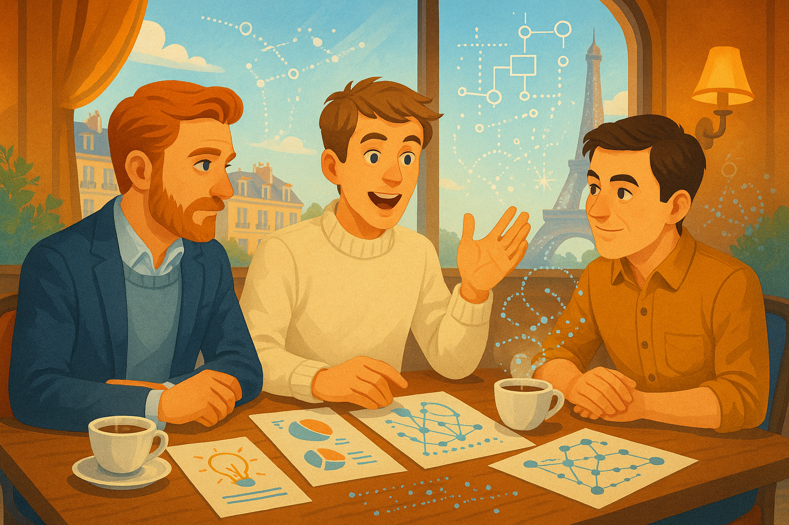
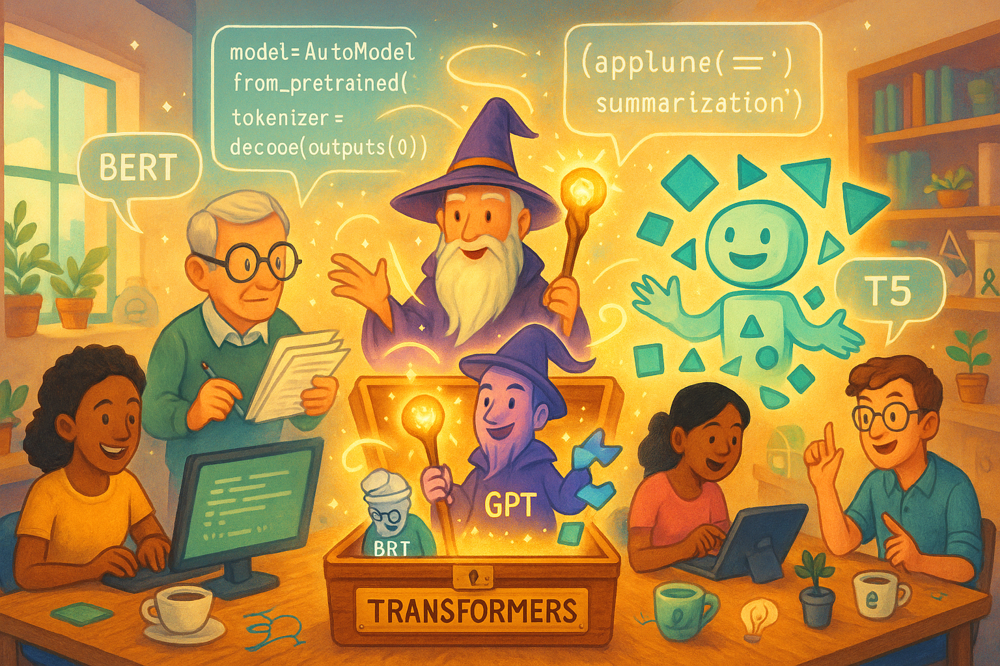
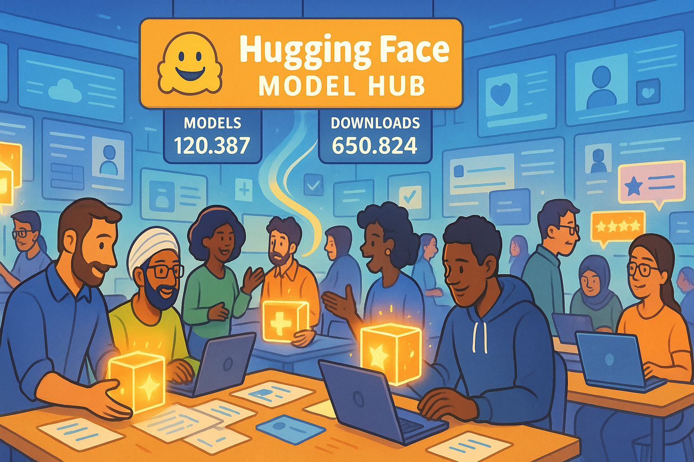
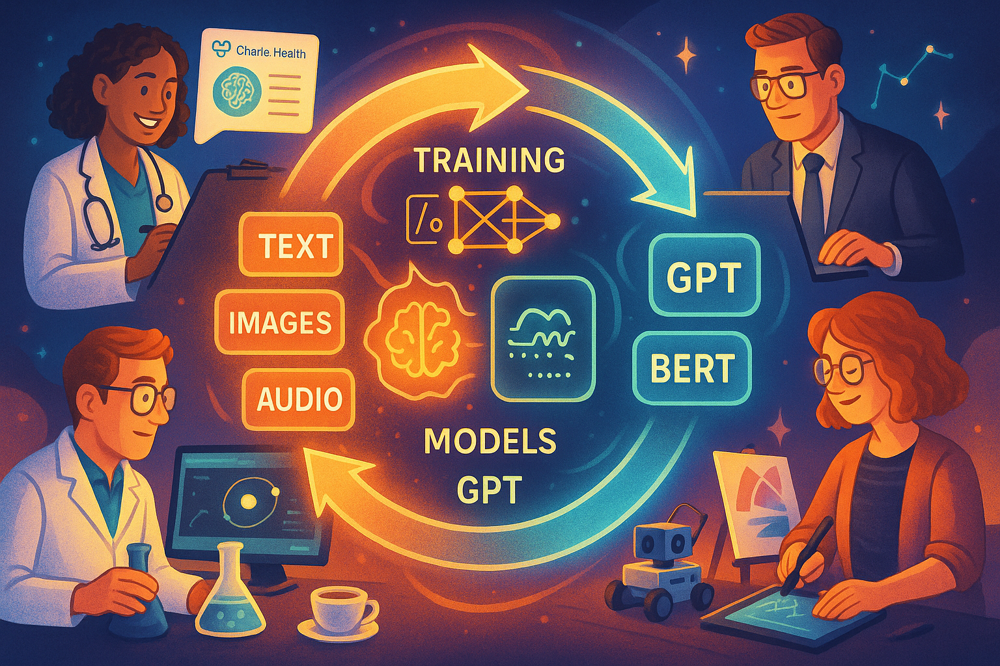
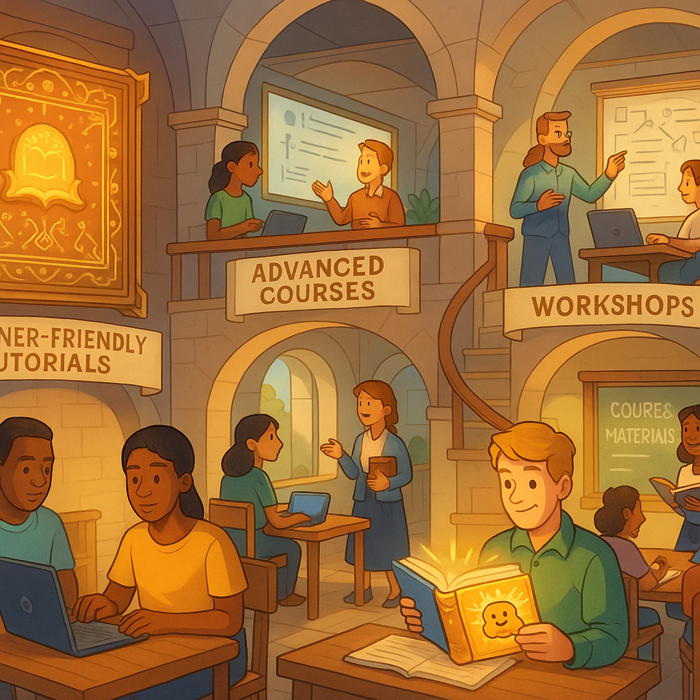
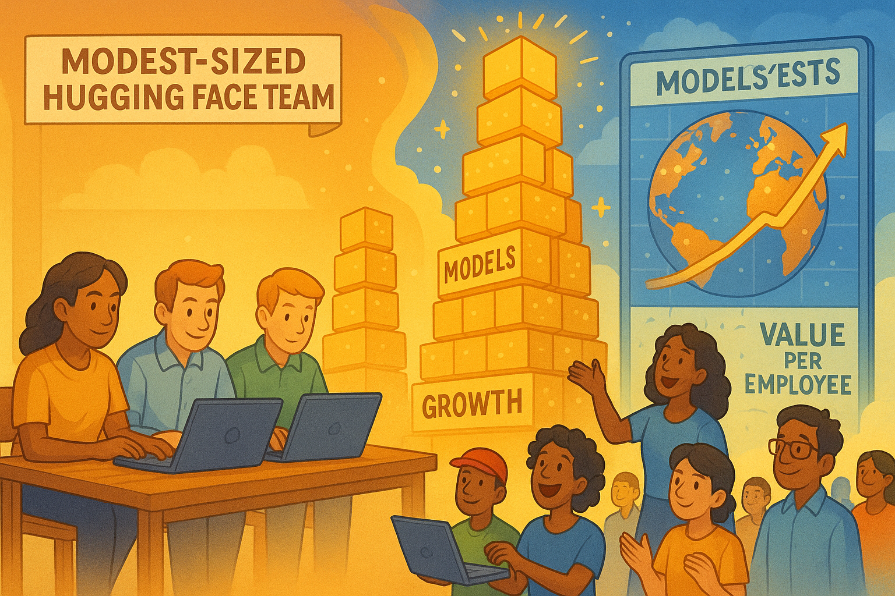
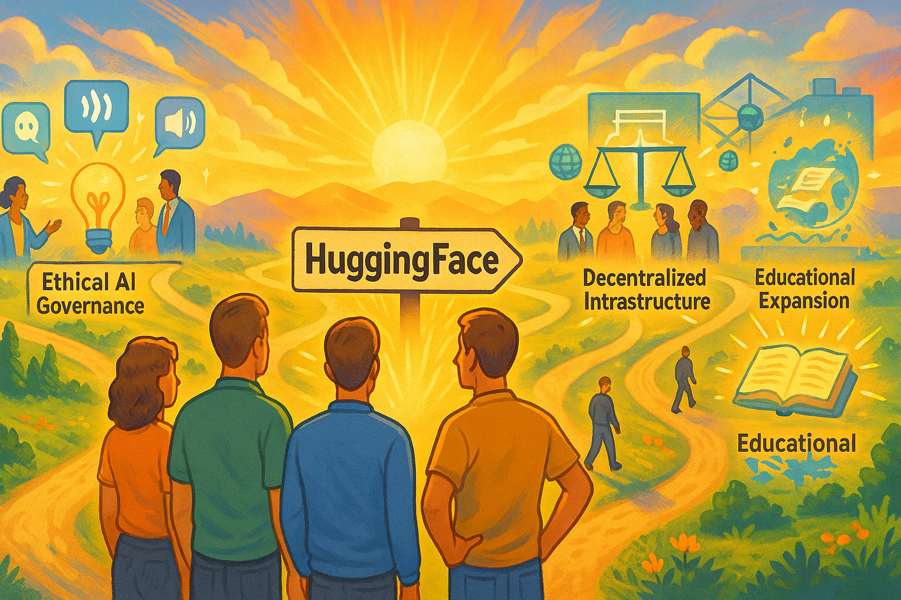
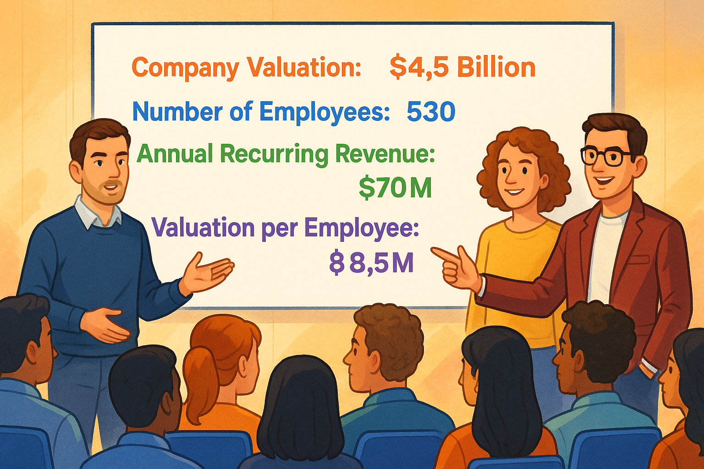

# The HuggingFace Revolution: How an AI Underdog Changed the Game


<details class="show-prompt">
  <summary>Show Narrative Prompt</summary>
Please create a detailed, fun and entertaining story about the formation of the company HuggingFace that would form the narrative text for a graph novel.

Focus on how the founders from France started by trying one plan but pivoted to another plan.
Describe the challenges the HuggingFace team faced and how they overcame these challenges. 

Describe the challenges and costs the team had building HuggingFace and how they cleverly use social networks to build a critical mass of models and the data used to create these models.  Show how they mastered the art of "Crowdsourcing" to get more people to upload their models and data to their site.

Compare the approach that HuggingFace used to the approaches that Microsoft, Google and Amazon used to store models, data and tools.

Mention that it is now just building a great faceted search tool to help people find models, but it is also the tools to use these models such as the Gradio and Streamlit programming libraries built around Python.  Be clear to mention the creation of HuggingFace Spaces to demonstrate inference of models.

Also focus on how HuggingFace has build world-class documentation and training on how to teach the use of integrating machine learning into classrooms.

Wrap up with a discussion that although HuggingFace is still a small company, the company valuation per employee is very high.  End on a positive note that understanding crowdsourcing is just one of their first innovations and there may be many more to come in the future.

Our goal is to have you generate the full text of the story, but to turn the story into a graphic novel with many illustrations that explain how the company HuggingFace was created. 

When appropriate, suggest an image that could be inserted into the story to make the story a graphic novel. Describe each image in detail and be consistent across all the images in the story for style.  When you describe an image, make sure to mention that it should be a colorful, bright wide-landscape drawing suitable for technology-forward optimistic graphic-novel.
</details>

## Chapter 1: A Parisian Beginning

In 2016, three visionaries from Paris - Clément Delangue, Julien Chaumond, and Thomas Wolf - came together in New York with a shared dream that would eventually reshape the AI landscape. But like many great stories, theirs didn't begin with the triumph we know today.


<details class="show-prompt">
  <summary>Show Image Prompt</summary>
  Please generate a new drawing.
 1: A colorful, bright wide-landscape drawing showing three young entrepreneurs meeting in a Parisian café, with the Eiffel Tower visible through the window. Their table is covered with sketches and notes, coffee cups scattered about. The style should be optimistic and tech-forward, with subtle digital elements blending into the traditional café scene - perhaps code or AI diagrams floating subtly in the steam from their coffee cups. The three founders should be depicted with distinct personalities but united in their enthusiastic discussion.
</details>

"We didn't start out planning to build the GitHub of machine learning," Clément would later recall. "Our first idea was actually building a consumer AI application - a chatbot assistant."

The year was 2016, and the three friends were convinced that conversational AI was the future. Their initial vision: create an engaging, helpful AI assistant that would make technology more human-like and accessible.

## Chapter 2: The Pivot

Their chatbot showed promise, attracting initial users who enjoyed the natural language interactions. But as they refined their product, the team encountered a fundamental challenge: the tools they needed to build truly impressive natural language processing systems simply weren't accessible enough.


<details class="show-prompt">
  <summary>Show Image Prompt</summary>
2: A colorful, bright wide-landscape drawing depicting the moment of pivot. The left side shows the team looking frustrated at screens displaying their chatbot with error messages and limitations. The right side shows a lightbulb moment with the same team excitedly sketching out a new platform architecture on a whiteboard. The transition between these scenes should use a dynamic, swirling design element to represent the transformation of their vision. The color palette shifts from muted tones on the left to vibrant, hopeful colors on the right.
</details>

"We realized we were spending more time building infrastructure than actually improving the user experience," Julien explained. "And we weren't alone. Every AI team was reinventing the wheel."

This recognition led to their pivotal moment in 2018 - instead of being just another chatbot company, they would build something far more fundamental: an open platform that democratized access to cutting-edge NLP models.

"What if," Thomas proposed during a late-night brainstorming session, "instead of keeping our models proprietary, we made them available to everyone? What if we created a place where researchers and developers could share their work too?"

And so, HuggingFace pivoted from being a consumer app company to a platform focused on making state-of-the-art NLP accessible to all.

## Chapter 3: The Underdog Challenge

The road ahead wasn't easy. As a small team with limited resources going up against tech giants, HuggingFace faced daunting challenges.


<details class="show-prompt">
  <summary>Show Image Prompt</summary>
3: A colorful, bright wide-landscape drawing showing the small HuggingFace team in their modest office, surrounded by towering skyscrapers labeled with tech giant logos (Google, Microsoft, Amazon). The HuggingFace office glows with a warm light while the towers appear cold and monolithic. The team is depicted working intensely on computers, with determination on their faces. Digital elements should show code flowing from their small space up toward the clouds, representing how their small-scale efforts began to have outsized impact.
</details>

"The big companies had hundreds of PhDs and seemingly unlimited compute resources," remembered Clément. "We had a handful of people and were watching every euro we spent on cloud computing."

Microsoft, Google, and Amazon were investing billions in AI research and infrastructure, building walled gardens where their best models remained proprietary and access was tightly controlled. Their approach: create dependency on their specific cloud platforms and tools.

Meanwhile, the HuggingFace team was scraping together funding to keep their servers running. But what they lacked in resources, they made up for with a powerful vision: AI should be open, collaborative, and accessible.

## Chapter 4: The Transformers Revolution


Their breakthrough came with the release of the Transformers library - a Python package that made implementing state-of-the-art NLP models surprisingly simple.

<details class="show-prompt">
  <summary>Show Image Prompt</summary>
4: A colorful, bright wide-landscape drawing portraying the Transformers library as a magical toolbox being opened, with various NLP models (BERT, GPT, T5, etc.) emerging as distinct characters or entities with their own personalities. Developers of various backgrounds are shown being empowered by these tools, creating applications instantly where previously complex machinery might have been required. The scene should have a sense of wonder and democratization, with code snippets visibly simplified and accessible.
</details>

"We wanted to make it so easy that a developer could implement BERT or GPT with just a few lines of code," said Julien. "No PhD required."

The timing was perfect. Just as the NLP field was experiencing a renaissance with breakthrough models like BERT and GPT, HuggingFace provided the tooling that made these innovations accessible to everyday developers.

The community response was immediate and enthusiastic. Suddenly, capabilities that had been limited to specialized AI labs were available to startups, individual developers, and researchers worldwide.

## Chapter 5: The Crowdsourcing Masterstroke

While the Transformers library put HuggingFace on the map, their true innovation was yet to come: the Model Hub, a platform where anyone could share and discover machine learning models.


<details class="show-prompt">
  <summary>Show Image Prompt</summary>
5: A colorful, bright wide-landscape drawing depicting the HuggingFace Model Hub as a bustling digital marketplace or library. Show researchers and developers from around the world (represented by diverse characters) both contributing models (uploading glowing digital packages) and discovering/downloading others' work. The scene should have a sense of abundance and community, with counters showing rapidly increasing numbers of models and downloads. Social network elements should be visible – people collaborating, rating models, and building on each other's work.
</details>

"We looked at how GitHub transformed software development through collaboration and version control," explained Clément. "We wanted to do the same for machine learning models."

The masterstroke was how they leveraged network effects. Each model uploaded to the Hub attracted users, who in turn became potential contributors of new models or improvements to existing ones. The platform became more valuable with every contribution.

Unlike the tech giants' approach of keeping their best models behind paywalls or API limitations, HuggingFace encouraged a culture of sharing that accelerated innovation across the entire field.

"Our strategy wasn't to build the best models ourselves," Thomas noted. "It was to create the best place for the community to share their models."

This approach proved remarkably effective at challenging the resources of much larger competitors. While Google and Microsoft spent millions developing individual models, HuggingFace was amassing thousands of models contributed by researchers and companies worldwide.

## Chapter 6: Datasets and the Virtuous Cycle

Recognizing that models are only as good as the data they're trained on, HuggingFace expanded their platform to include datasets, creating a complete ecosystem for machine learning.


<details class="show-prompt">
  <summary>Show Image Prompt</summary>
6: A colorful, bright wide-landscape drawing illustrating the virtuous cycle between models and datasets. The image should be designed as a circular flow diagram, where datasets (represented as diverse data collections) feed into model training processes, which produce improved models, which then help create better datasets. Around this central cycle, show practitioners from various fields (medicine, finance, science, arts) both contributing to and benefiting from this ecosystem. The visualization should emphasize how this collaborative approach accelerates progress for everyone.
</details>

This created a virtuous cycle: more high-quality public datasets led to better models, which attracted more developers, who in turn contributed more datasets and models.

"The traditional companies were trying to capture value by restricting access," said Clément. "We captured value by maximizing access and participation."

This approach also addressed one of AI's biggest challenges: the centralization of power in the hands of a few large companies with the resources to collect massive proprietary datasets. By building a community-driven repository of open datasets, HuggingFace helped democratize access to the fuel that drives AI progress.

## Chapter 7: Building for Usability

The HuggingFace team recognized that powerful models and datasets wouldn't matter if people couldn't easily use them. This led to their focus on building exceptional tools for implementation and demonstration.


<details class="show-prompt">
  <summary>Show Image Prompt</summary>
7: A colorful, bright wide-landscape drawing showing the HuggingFace tools ecosystem as an interconnected set of platforms. Central to this should be a visualization of Spaces (showing live demo environments), connected to Gradio and Streamlit interfaces (depicted as intuitive control panels). Show diverse users easily deploying complex AI models with simple interfaces, with minimal coding visible. The scene should convey how technical complexity is being hidden behind user-friendly tools, with arrows connecting the various components of the ecosystem.
</details>

With the integration of Gradio and Streamlit, and the launch of HuggingFace Spaces, they made it possible for anyone to demonstrate their models with interactive web interfaces.

"Seeing is believing," Julien emphasized. "We wanted people to be able to try models instantly, without downloading anything or writing a line of code."

This approach stood in stark contrast to the complex integration processes typical of cloud AI offerings from the major platforms, which often required considerable technical expertise and platform-specific knowledge.

Spaces became a game-changer, allowing model creators to showcase their work with interactive demos that anyone could try with a simple browser visit. This dramatically shortened the path from research to practical application.

## Chapter 8: Education as Exponential Growth

Perhaps HuggingFace's most strategic investment was in education and documentation. They recognized that knowledge barriers were as limiting as technical ones.


<details class="show-prompt">
  <summary>Show Image Prompt</summary>
8: A colorful, bright wide-landscape drawing depicting HuggingFace's educational ecosystem. Show a multi-level learning environment with beginner-friendly tutorials at the base, advanced courses in the middle, and specialized workshop spaces at the top. Include teachers and students of diverse backgrounds engaging with the materials. Visual elements should include exceptional documentation (represented as illuminated manuscripts or magical books), course materials, and classroom integration scenarios. The scene should convey how knowledge is being transferred seamlessly across different expertise levels.
</details>

"Many companies treat documentation as an afterthought," Thomas observed. "We saw it as central to our mission of democratization."

The team invested heavily in creating world-class documentation, tutorials, courses, and learning resources. Their "Hugging Face Course" became a gold standard for practical NLP education, used in universities and by self-learners worldwide.

They particularly focused on helping educators bring machine learning into classrooms, creating specialized resources for teachers and professors who wanted to incorporate AI into their curriculum.

"When you educate someone, you don't just gain a user – you empower an innovator who might create something you never imagined," said Clément.

This educational approach amplified their community-building efforts. Each new person they taught became a potential contributor to their ecosystem, creating a sustainable growth engine that the resource-intensive approaches of larger companies couldn't match.

## Chapter 9: The Value of Community

By 2023, HuggingFace had achieved something remarkable: as a relatively small company of a few hundred employees, they had built a platform hosting over 150,000 models, 20,000 datasets, and serving more than 10 million monthly visitors.

<details class="show-prompt">
  <summary>Show Image Prompt</summary>
9: A colorful, bright wide-landscape drawing visualizing HuggingFace's impact relative to company size. On the left, show the modest-sized HuggingFace team. On the right, display their outsized impact through visualizations of exponential community growth - towers of models and datasets reaching skyward, global user maps with hotspots across all continents, and value metrics showing astronomical per-employee impact. Use size contrasts to emphasize how their lean approach generated massive outcomes. Include visual elements showing community members as co-creators rather than just users.
</details>

"Our valuation per employee is among the highest in tech," noted Clément during a company milestone celebration. "Not because we're focused on financials, but because our approach of empowering a community creates value far beyond what our headcount would suggest."

While tech giants were hiring thousands of AI researchers to work behind closed doors, HuggingFace had orchestrated a global, collaborative research community that operated largely in the open.

"The breakthrough was realizing that in AI, the traditional competitive advantages – secrecy and resource concentration – could be countered by transparency and community," explained Julien.

## Chapter 10: The Road Ahead

As HuggingFace continued to grow, they remained focused on their mission of democratizing artificial intelligence.


<details class="show-prompt">
  <summary>Show Image Prompt</summary>
10: A colorful, bright wide-landscape drawing showing the future vision of HuggingFace. The image should depict the team standing at a crossroads with multiple exciting paths ahead. Each path represents different potential directions: multimodal AI (showing vision, audio, and text integration), ethical AI governance (represented by balanced scales and diverse oversight committees), decentralized infrastructure (shown as distributed computing nodes), and educational expansion (illustrated as knowledge spreading globally). The team should be looking forward with optimism, with light emanating from their collective vision. Community members should be visible on each path, emphasizing continued collaboration.
</details>

"Crowdsourcing models and datasets was just our first innovation," Thomas reflected. "We're exploring new frontiers in multimodal AI, multilingual capabilities, and ethical AI governance."

The company remained committed to its community-first approach, continuing to prioritize openness even as they built enterprise offerings to sustain their growth.

"There's a false dichotomy between doing good and building a successful business," Clément argued. "Our experience shows that by genuinely empowering a community, you can create both social and economic value."

As larger competitors began adopting elements of HuggingFace's open approach, it became clear that this small company from Paris had fundamentally changed how the AI industry operates.

Their story serves as a powerful reminder that in technology, the most transformative innovations often come not from having the most resources, but from reimagining how resources can be organized and shared.

"The future of AI isn't a winner-take-all competition," concluded Julien. "It's a collaborative effort where progress comes from combining the best ideas from everywhere. That's the world we're helping to build."

<iframe src="chart1.html" width="100%" height="540px" scrolling="no"></iframe>

??? code "Show chart code"
    ```js
    import React from 'react';
    import { LineChart, Line, XAxis, YAxis, CartesianGrid, Tooltip, Legend, ResponsiveContainer } from 'recharts';

    const HuggingFaceModelsGrowth = () => {
    // Data based on search results and projections
    // For the early years, we have more estimates based on growth trends
    // Later years have more concrete numbers from the search results
    const data = [
        { date: '2018-01', models: 50 },
        { date: '2018-07', models: 300 },
        { date: '2019-01', models: 1000 },
        { date: '2019-07', models: 2500 },
        { date: '2020-01', models: 5000 },
        { date: '2020-07', models: 10000 },
        { date: '2021-01', models: 25000 },
        { date: '2021-07', models: 50000 },
        { date: '2022-01', models: 100000 },
        { date: '2022-07', models: 200000 },
        { date: '2023-01', models: 300000 },
        { date: '2023-07', models: 400000 },
        { date: '2024-01', models: 760460 }, // From search results about their extensive analysis
        { date: '2024-07', models: 900000 }, // From recent docs showing over 900k models
        { date: '2025-01', models: 1200000 },
        { date: '2025-04', models: 1639648 } // Final point as requested
    ];

    const formatYAxis = (tickItem) => {
        if (tickItem >= 1000000) {
        return `${(tickItem / 1000000).toFixed(1)}M`;
        } else if (tickItem >= 1000) {
        return `${(tickItem / 1000).toFixed(0)}K`;
        }
        return tickItem;
    };

    const formatTooltip = (value) => {
        if (value >= 1000000) {
        return `${(value / 1000000).toFixed(2)} million`;
        } else if (value >= 1000) {
        return `${(value / 1000).toFixed(1)}K`;
        }
        return value;
    };

    const CustomTooltip = ({ active, payload, label }) => {
        if (active && payload && payload.length) {
        return (
            <div className="bg-white p-2 border border-gray-300 rounded shadow-lg">
            <p className="font-semibold">{label}</p>
            <p className="text-blue-600">
                Models: {formatTooltip(payload[0].value)}
            </p>
            </div>
        );
        }
        return null;
    };

    return (
        <div className="w-full h-full flex flex-col p-4">
        <h2 className="text-2xl font-bold text-center mb-4">Hugging Face Models Growth (2018-2025)</h2>
        <div className="flex-1 w-full">
            <ResponsiveContainer width="100%" height={400}>
            <LineChart
                data={data}
                margin={{
                top: 20,
                right: 30,
                left: 20,
                bottom: 50,
                }}
            >
                <CartesianGrid strokeDasharray="3 3" />
                <XAxis 
                dataKey="date" 
                angle={-45} 
                textAnchor="end" 
                height={60}
                tick={{fontSize: 12}}
                />
                <YAxis 
                tickFormatter={formatYAxis}
                tick={{fontSize: 12}}
                />
                <Tooltip content={<CustomTooltip />} />
                <Legend verticalAlign="top" height={36} />
                <Line
                type="monotone"
                dataKey="models"
                name="Number of Models"
                stroke="#FF6D91"
                strokeWidth={3}
                dot={{ r: 4 }}
                activeDot={{ r: 8 }}
                />
            </LineChart>
            </ResponsiveContainer>
        </div>
        <div className="text-sm text-gray-500 mt-4">
            <p>Data sources: Based on publicly available information from Hugging Face documentation and research papers.</p>
            <p>Note: Early data (2018-2022) is estimated based on growth trends. 2024-2025 includes projections to reach 1.64M models by April 2025.</p>
        </div>
        </div>
    );
    };

    export default HuggingFaceModelsGrowth;
    ```

As of April 2026, Hugging Face stores over is now by far the largest repository of models, data and applications that demonstrate how these models are used.  Hugging Face continues to be one of the key hubs of models and applications for machine learning for the industry.  Many organizations now
use Hugging Face software to build and extend their own internal model hubs.


<details class="show-prompt">
  <summary>Show Image Prompt</summary>
</details>
---

*And so, the HuggingFace journey continues – a testament to how a small team with a powerful vision can reshape an industry dominated by giants, not through outspending them, but by out-thinking them and building something bigger than themselves: a global community united by the shared goal of making AI accessible to all.*

## References

- [Wikipedia Page on Hugging Face](https://en.wikipedia.org/wiki/Hugging_Face)
-   [TechCrunch: Hugging Face Wants to Become Your Artificial BFF](https://techcrunch.com/2017/03/09/hugging-face-wants-to-become-your-artificial-bff/) - March 9, 2017 - TechCrunch
-   [Betaworks Camp: BotCamp Launch](https://www.betaworks.com/camp) - 2016 - Betaworks
-   [TechCrunch: Hugging Face Raises $235M](https://techcrunch.com/2023/08/24/hugging-face-raises-235m-from-investors-including-salesforce-and-nvidia/) - August 29, 2023 - TechCrunch
-   [Wikipedia: Hugging Face Foundation](https://en.wikipedia.org/wiki/Hugging_Face) - February 15, 2025 - Wikipedia
-   [Contrary Research: Hugging Face Business Breakdown & Founding Story](https://research.contrary.com/company/hugging-face) - 2023 - Contrary Research
-   [Sifted: How Hugging Face Got French Tech Talking](https://sifted.eu/articles/hugging-face-interview-julien-chaumond) - April 5, 2024 - Sifted
-   [TechCrunch: Hugging Face Raises $15 Million](https://techcrunch.com/2019/12/17/hugging-face-raises-15-million-to-build-the-definitive-natural-language-processing-library/) - December 17, 2019 - TechCrunch
-   [KITRUM: The Inspiring Journey of Clément Delangue](https://kitrum.com/blog/the-inspiring-journey-of-clement-delangue-hugging-faces-founder/) - February 2025 - KITRUM
-   [Fast Company: How Clément Delangue is Open-Sourcing AI](https://www.fastcompany.com/90909717/clement-delangue-ceo-hugging-face-most-creative-people-2023) - July 12, 2023 - Fast Company
-   [Maginative: Hugging Face Raises $235M in New Funding](https://www.maginative.com/article/hugging-face-raises-235m-in-new-funding-from-major-tech-giants-including-google-nvidia-and-salesforce/) - August 24, 2023 - Maginative
- [LinkedIn Hugging Face People](https://www.linkedin.com/company/huggingface/people/) showing 534 employees in April of 2025.