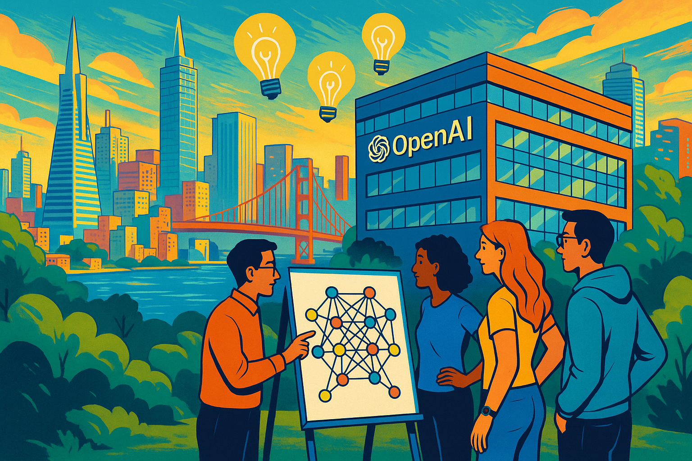
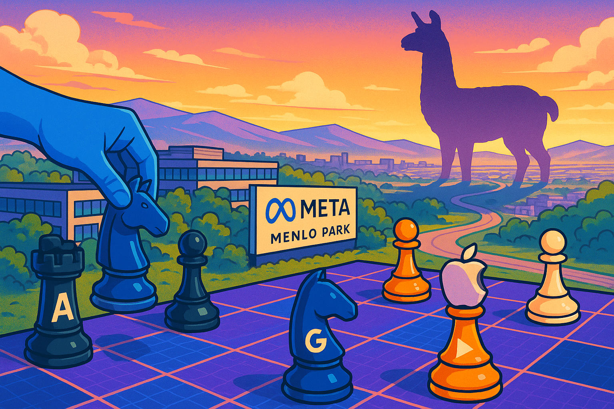

# Deep Learning Stories

Here are some examples of how Generative AI tools can be used
to generate graphic-novel like stories.  I used Anthropic Claude 3.7 to generate the narrative text for these stories.  In my prompt, I stated *When appropriate, suggest an image that could be inserted into the story to make the story a form of graphic novel.*
I then use OpenAI's ChatGPT o4 to generate the images.

## The AI Winters Story

{width="300"}

The AI field experienced dramatic cycles of enthusiasm and disappointment known as "AI winters" from the 1950s until 2012. Starting with grand promises from pioneers like McCarthy, Simon, and Minsky in the 1950s-60s, the field faced its first winter in 1973 after the Perceptron limitations were exposed and funding dried up. It rebounded in the 1980s with expert systems, only to crash again by 1987 when these systems proved brittle and impractical. A quieter machine learning era emerged in the 1990s with modest successes like Deep Blue, but it wasn't until 2012 when AlexNet's breakthrough at the ImageNet competition finally broke the boom-bust cycle, ushering in an "eternal spring" for AI that continues today.

[Read The AI Winters Story](./ai-winters/index.md)

## The AlexNet Story

{width="200px" }

This graphic novel sequence tells the origin story of deep learning's revolution, beginning with "The Toronto Trio"—Alex Krizhevsky, Ilya Sutskever, and Geoffrey Hinton—facing the monumental challenge of neural networks. In "The GPU Awakening," they harness the power of gaming GPUs to accelerate training. "The Training Vigil" captures their relentless effort, leading to "The Revealing," where AlexNet stuns the world with a groundbreaking 15.3% error rate. "The Revolution Begins" shows the global ripple effect as labs adopt deep learning and AI breakthroughs multiply. The story concludes with "The Neural Future," a hopeful epilogue depicting modern AI applications branching out from the glowing seed of AlexNet.

[Read the Alexnet Story](./alexnet/index.md)

## Transformers and Attention

{width="300"}

"Attention Revolution: How a Paper Changed AI Forever" tells the story of how a team of eight researchers at Google (Ashish Vaswani, Noam Shazeer, Niki Parmar, Jakob Uszkoreit, Llion Jones, Aidan Gomez, Łukasz Kaiser, and Illia Polosukhin) revolutionized AI in 2017 with their paper "Attention Is All You Need." Working largely as a side project, they developed the transformer architecture that replaced traditional RNNs and CNNs with a revolutionary self-attention mechanism, allowing words to directly relate to each other regardless of distance. Despite internal concerns about giving away competitive advantages, they published their findings, which quickly became the foundation for modern language models like BERT, GPT, and later large language models. The paper's key innovation—the attention mechanism—proved remarkably versatile and scalable, enabling AI to better understand context and references (like knowing "it" refers to "chicken" in "The chicken did not cross the road because it was too tired"), ultimately transforming not just natural language processing but the entire field of artificial intelligence.

[Read the Attention Revolution](./transformers/index.md)

## The Launch of ChatGPT
{width="300"}

This graphic novel chronicles how OpenAI's ChatGPT revolutionized artificial intelligence, beginning with a team of visionaries building on GPT-3's foundation to create a truly conversational AI assistant. Their breakthrough came through Reinforcement Learning from Human Feedback (RLHF), where human trainers guided the system toward more helpful, truthful responses. After an intense development sprint, ChatGPT's November 2022 launch saw unprecedented adoption, reaching a million users in just five days and triggering an industry-wide AI race. The story follows ChatGPT's evolution through GPT-4's multimodal capabilities, showcasing its impact across education, business, and software development while acknowledging ongoing challenges of alignment and truthfulness. Ultimately, ChatGPT transformed AI from an abstract concept into a personal experience, democratizing access to powerful language technology and sparking crucial global conversations about AI's role in society.

[Read the ChatGPT Story](./chatgpt/index.md)

## Meta's Llama
{width="300"}

In a bold strategic move that reshaped the AI industry, Meta invested billions to develop its Llama large language models, only to release them as open-source technology available to everyone. This "graphic novel" chronicles how Meta assembled an elite team of AI researchers, overcame massive computational challenges requiring thousands of specialized GPUs, and spent approximately $5-7 billion on training before making the shocking decision to release Llama 2 with an "open forever" commitment in July 2023. The decision effectively implemented a "scorched earth" strategy that undermined competitors' ability to charge premium prices for similar technology, transformed the AI job market from core model development to application building, and democratized access to advanced AI. While causing short-term disruption for companies planning to sell proprietary models, Meta's decision ultimately accelerated innovation by allowing developers worldwide to build on top of these powerful models rather than recreating them, all while strategically positioning Meta to focus on integrating AI throughout its own products and metaverse vision.

[Read the Meta Llama Story](./meta-llama/index.md)

## DeepSeek R1
{width="300"}

The DeepSeek-R1 story portrays a small, resourceful team challenging the AI industry's "bigger is better" paradigm by creating a remarkably efficient language model through innovative architecture choices. Using Mixture of Experts technology, custom software optimization, and strategic resource management, they build a powerful AI system that can run on consumer-grade hardware while delivering capabilities comparable to models requiring vastly more resources. The narrative highlights how their focus on data quality over quantity, specialized training methodologies, and superior engineering allows DeepSeek-R1 to democratize AI access—enabling applications like generating entire educational textbooks on personal computers and empowering users worldwide who lack enterprise infrastructure, ultimately proving that thoughtful design can triumph over brute-force approaches in advancing AI technology.

[Read the DeepSeek R1 Story](./deepseek-r1/index.md)
