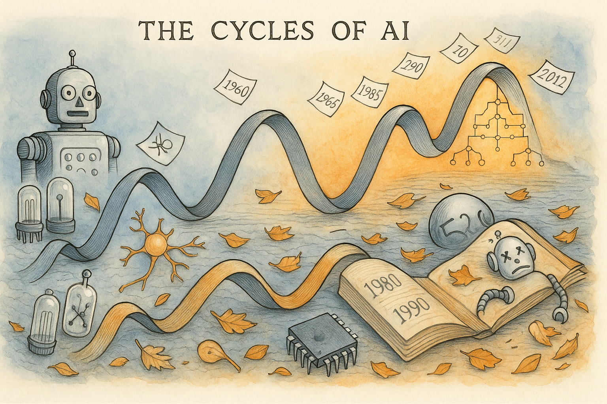

# Deep Learning Stories

Here are some examples of how Generative AI tools can be used
to generate graphic-novel like stories.  I used Anthropic Claude 3.7 to generate the narrative text for these stories.  In my prompt, I stated *When appropriate, suggest an image that could be inserted into the story to make the story a form of graphic novel.*
I then use OpenAI's ChatGPT o4 to generate the images.

## The AI Winters Story

{width="300"}

The AI field experienced dramatic cycles of enthusiasm and disappointment known as "AI winters" from the 1950s until 2012. Starting with grand promises from pioneers like McCarthy, Simon, and Minsky in the 1950s-60s, the field faced its first winter in 1973 after the Perceptron limitations were exposed and funding dried up. It rebounded in the 1980s with expert systems, only to crash again by 1987 when these systems proved brittle and impractical. A quieter machine learning era emerged in the 1990s with modest successes like Deep Blue, but it wasn't until 2012 when AlexNet's breakthrough at the ImageNet competition finally broke the boom-bust cycle, ushering in an "eternal spring" for AI that continues today.

[Read The AI Winters Story](./ai-winters/index.md)

## The AlexNet Story

{width="200px" }

This graphic novel sequence tells the origin story of deep learning's revolution, beginning with "The Toronto Trio"—Alex Krizhevsky, Ilya Sutskever, and Geoffrey Hinton—facing the monumental challenge of neural networks. In "The GPU Awakening," they harness the power of gaming GPUs to accelerate training. "The Training Vigil" captures their relentless effort, leading to "The Revealing," where AlexNet stuns the world with a groundbreaking 15.3% error rate. "The Revolution Begins" shows the global ripple effect as labs adopt deep learning and AI breakthroughs multiply. The story concludes with "The Neural Future," a hopeful epilogue depicting modern AI applications branching out from the glowing seed of AlexNet.

[Read the Alexnet Story](./alexnet/index.md)

