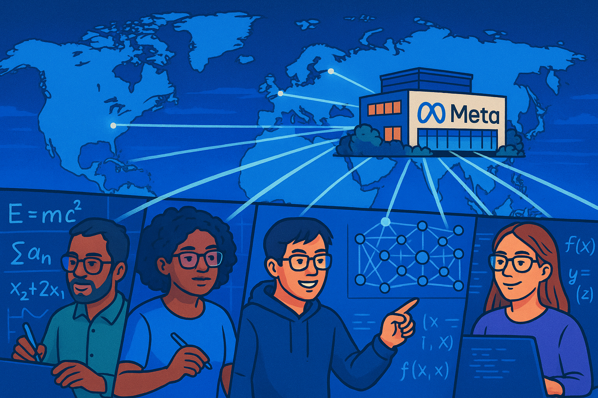
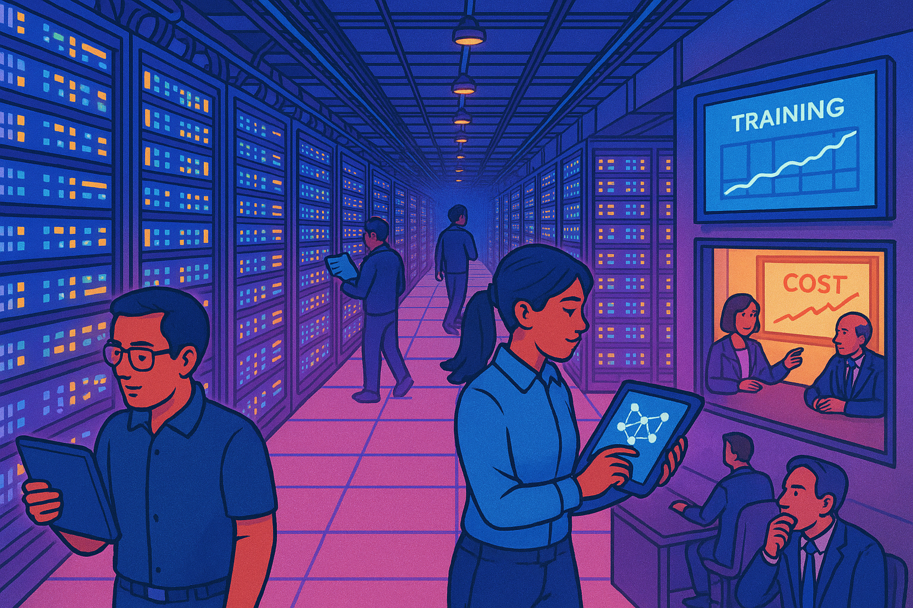
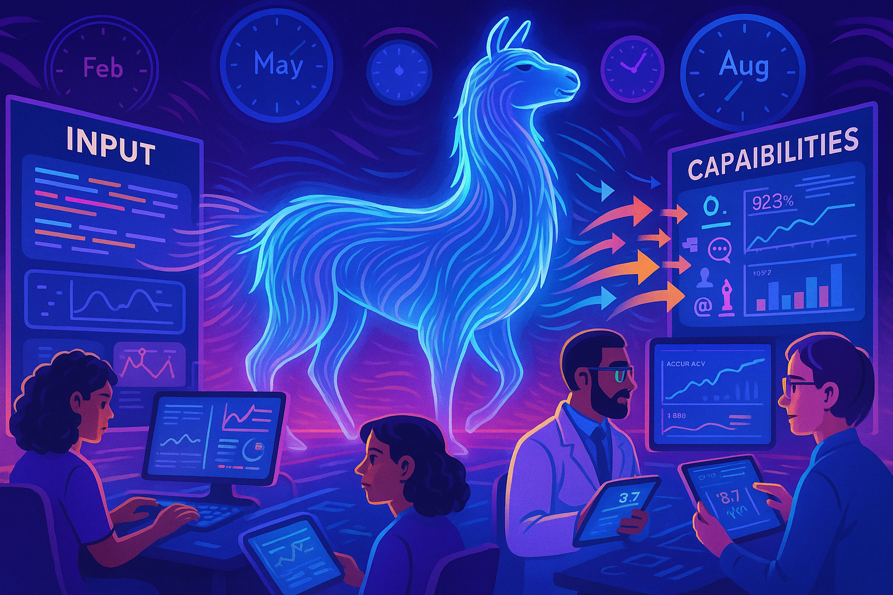
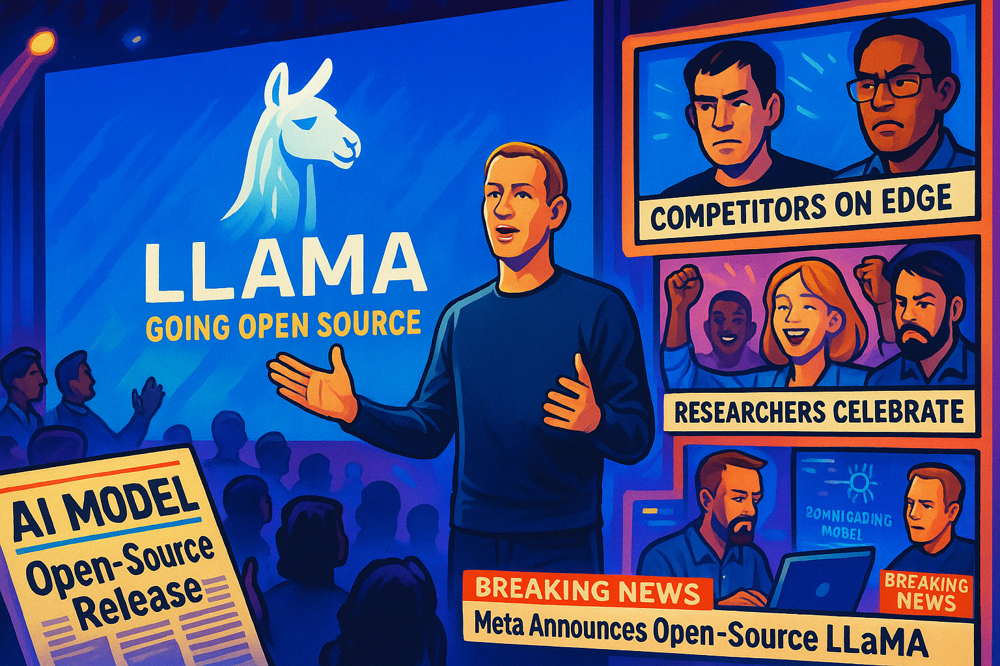
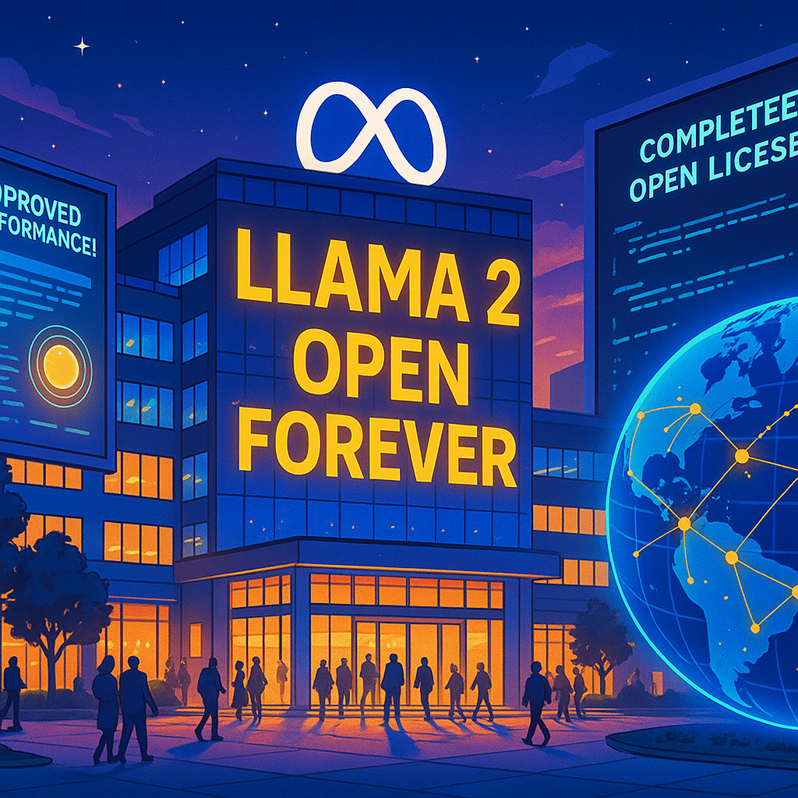
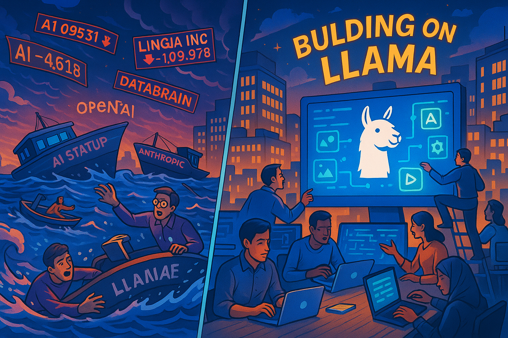
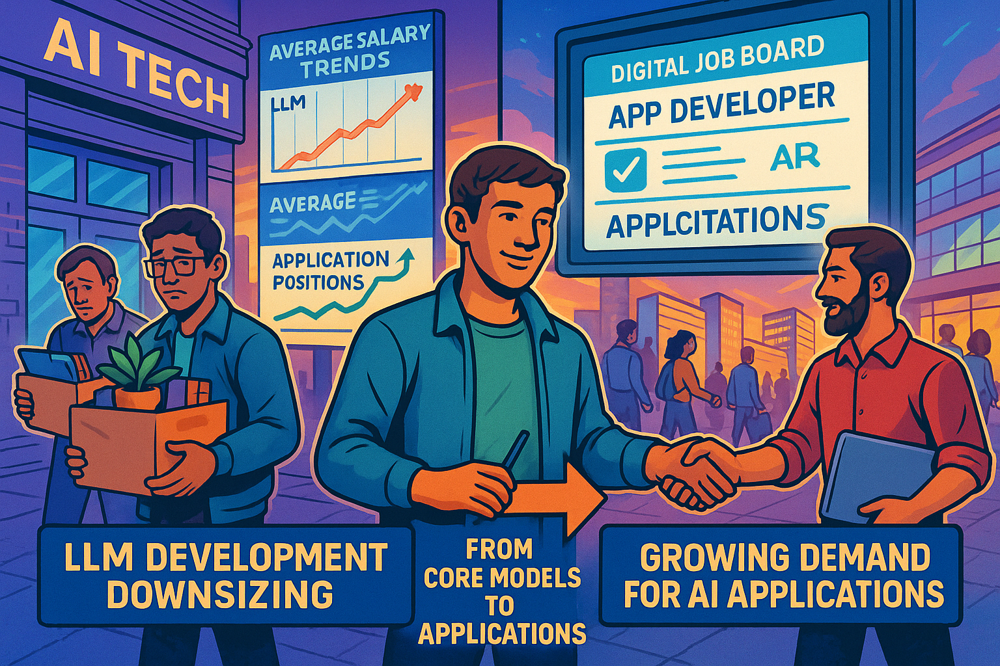
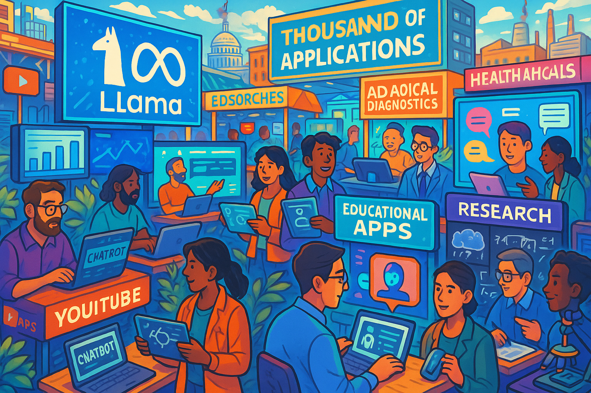
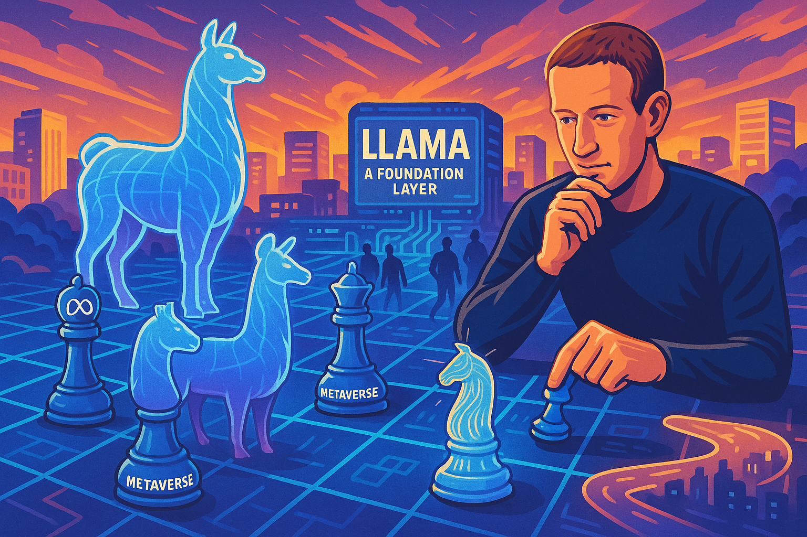
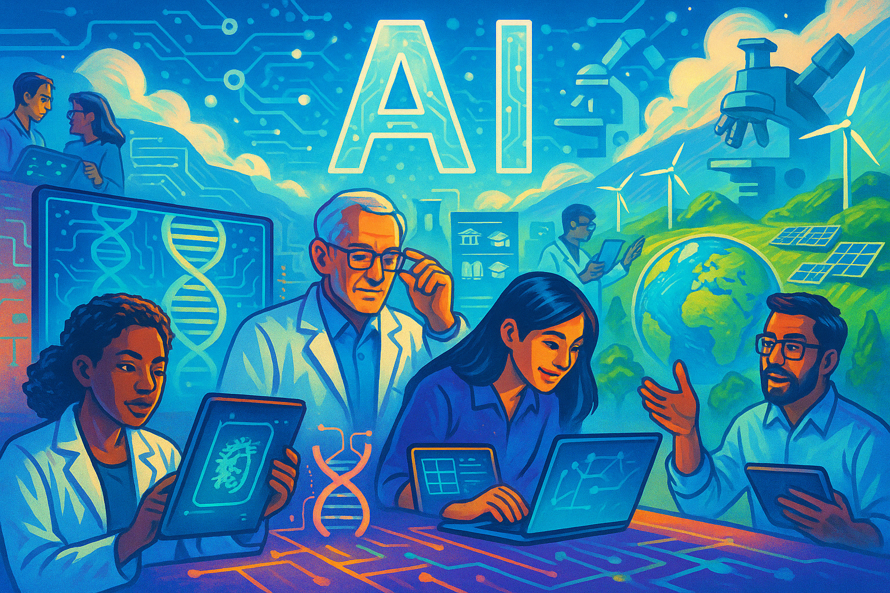

# The Llama Effect: How Meta Disrupted the LLM Industry

  
Show Narrative Prompt

Title: Making LLMs free: How Meta disrupted the LLM industry by giving away a product that took billions of dollars to build.

Please create a detailed, fun and entertaining story about the decision that Meta made to build the large language model called "Llama" and its relevance to the rise open LLMs.

Describe the challenges and costs the team at Meta had building Llama such as getting GPUS and how they overcame these challenges. Describe the incredible time and money that went into building Llama 2.

Discuss the tradeoffs that the company Meta discussed internally to make it open source or charge for its use.  Discuss the strategy of "scorched earth" where you give a product away for free to prevent competitors from being able to charge for a product.  Describe the impact this had on other firms that were trying to sell access to their LLMs.  Describe how the job market for LLM engineers collapsed after Llama 2 and future versions was made open source "forever".

Our goal is to have you generate the full text of the story, but to turn the story into a graphic novel with many illustrations that explain how the Meta product Llama was created.  

When appropriate, suggest an image that could be inserted into the story to make the story a graphic novel. Describe each image in detail and be consistent across all the images in the story for style.  When you describe an image, make sure to mention that it should be a colorful, bright wide-landscape drawing suitable for technology-forward optimistic graphic-novel.

## Chapter 1: The AI Arms Race Begins

  
Show Image Prompt

Image 1: Create a colorful, bright wide-landscape drawing showing Meta headquarters in Menlo Park with a giant llama silhouette casting a shadow over Silicon Valley. In the foreground, tech companies are represented as chess pieces on a digital board, with Meta making a bold move. The style should be vibrant with tech-forward optimistic graphic-novel aesthetics.

In the sprawling tech campus of Meta in Menlo Park, California, executives gathered in a glass-walled conference room in early 2022. The AI landscape was changing rapidly. OpenAI's GPT models and Google's research were capturing headlines and imagination. Meta, despite its massive resources and talent pool, was being perceived as falling behind in the AI revolution.

"We can't afford to be left out of this," said Mark Zuckerberg, Meta's CEO, scanning the room. "The future of tech is being reshaped by large language models. We need our own competitive offering."

The tech giant had already invested billions in AI research through its FAIR (Facebook AI Research) lab established in 2013. But now, a more ambitious project was taking shape - one that would eventually become known as Llama.

"What if we don't just build another closed AI system?" suggested one executive. "What if we take a completely different approach?"

## Chapter 2: Assembling the Team

Image Prompt

Image 2: Create a colorful, bright wide-landscape drawing depicting a montage of Meta AI researchers being recruited from around the world. The image shows a global map with light beams connecting to Meta headquarters, with diverse faces of researchers working on complex equations and neural architecture diagrams. The style should maintain the tech-forward optimistic graphic-novel aesthetics with vibrant blues and purples.

Meta began assembling an elite team of AI researchers, computational linguists, and engineering specialists from across the globe. The project would need the brightest minds in natural language processing, reinforcement learning, and distributed computing.

Unlike traditional product teams that might work in isolation until launch, this team had a clear mandate: build a foundation model that could compete with or exceed the capabilities of GPT and other leading models, but with the potential to be shared with the world.

"We're bringing together people who believe AI should be more open," explained one team leader during an early all-hands meeting. "This isn't just about catching up to competitors; it's about changing the game entirely."

The team quickly expanded to hundreds of specialists, many relocating to California to join what was becoming one of the most ambitious AI projects in Meta's history.

## Chapter 3: The GPU Challenge

Image Prompt

3: A colorful, bright wide-landscape drawing showing a massive data center filled with rows of GPU servers glowing with processing power. Engineers are shown navigating between server racks with diagnostic tablets, while monitors display training progress. In one corner, executives are reviewing mounting cost projections. The style should convey both technological scale and the financial investment with bright, optimistic tech-forward aesthetics.

By mid-2022, the first major obstacle became apparent: securing enough computational power. Training a large language model requires enormous computational resources, primarily in the form of specialized GPUs (Graphics Processing Units).

"We need thousands of NVIDIA A100 GPUs to train at the scale we're planning," explained the infrastructure lead. "And we're in the middle of a global chip shortage."

The team faced a harsh reality: even for a company with Meta's resources, obtaining the necessary hardware during a worldwide semiconductor shortage was a significant challenge. The price per GPU had skyrocketed to over $10,000 each, and Meta would need thousands of them.

"We're looking at an initial hardware investment of over $100 million just to begin serious training," the financial team reported. "And that's assuming we can even secure the supply."

Meta leveraged its industry relationships, made advance commitments, and even designed custom cooling solutions to maximize GPU efficiency. The company repurposed entire data centers, prioritizing the Llama project over other computational needs.

"This is probably the largest computational undertaking in our company's history," noted one engineering director as they toured a newly configured data center in Nevada, rows of specialized servers humming with activity.

## Chapter 4: The Training Begins

Image Prompt

4: A colorful, bright wide-landscape drawing showing a visualization of the Llama training process. The image features a translucent llama figure composed of flowing data streams, with researchers monitoring real-time metrics on futuristic displays. Clock faces around the scene show the passage of months. One side shows the input of diverse text datasets flowing into the model, while the other shows emerging capabilities. The style should be dynamic and educational with the tech-forward optimistic aesthetic maintained throughout.

By late 2022, training on the first Llama model began in earnest. The process would consume millions of dollars in computing resources each day.

"We're processing trillions of tokens from hundreds of languages," explained the lead data scientist. "The model is learning from books, articles, code repositories, scientific papers - basically the written knowledge of humanity."

Training a model of this scale wasn't just expensive; it was a technical marathon. Engineers worked in shifts, monitoring the training process 24/7. Any instability or unexpected behavior could waste days of computing time worth millions of dollars.

"It's like building a rocket while it's launching," quipped one engineer during a 3 AM troubleshooting session. "We're constantly adjusting parameters, addressing biases, and fixing training anomalies."

The scale was unprecedented for Meta. Each day of training cost approximately $2-3 million in computing resources alone. Over months of training, fine-tuning, and iterative improvements, the total cost would climb into the billions.

"We're spending more each week on this project than many AI startups have raised in total," observed one executive during a budget review. "This better work."

## Chapter 5: The First Results

 
Image Prompt

 5: A colorful, bright wide-landscape drawing showing the first internal demonstrations of Llama capabilities. The scene depicts an auditorium at Meta headquarters where executives and team members are watching demonstrations on a giant screen. The screen shows Llama solving complex problems, generating code, and answering questions in multiple languages. Reactions range from amazement to strategic contemplation. The style should convey the excitement of breakthrough with the tech-forward optimistic graphic-novel aesthetic.
 

By early 2023, the first complete version of Llama was ready for internal testing. The results exceeded expectations. The model demonstrated remarkable capabilities in reasoning, language understanding, and knowledge representation - sometimes surpassing competing models on benchmark tests.

"It's working," announced the project lead during the first major demonstration to Meta's executive team. "In some domains, we're seeing performance that matches or exceeds models from OpenAI and Anthropic."

What made Llama particularly notable was its efficiency. The model achieved impressive results with fewer parameters than competitors, making it potentially more accessible for organizations with limited computational resources.

As impressive as the technical achievements were, a bigger question loomed: what would Meta do with this powerful new technology? The traditional approach would be to create a proprietary service, similar to ChatGPT or Claude, and monetize access.

But some on the team had more radical ideas.

## Chapter 6: The Strategic Debate

 
Image Prompt

 6: A colorful, bright wide-landscape drawing depicting a heated boardroom debate at Meta. The scene shows executives divided across a long table, with projection slides showing different business models. One side shows traditional monetization strategies with dollar signs, while the other shows open-source approaches with community growth metrics. Zuckerberg is at the head of the table, contemplatively listening to arguments from both sides. The style should convey the tension of this pivotal decision with dramatic lighting while maintaining the tech-forward optimistic graphic-novel aesthetic.
 

As Llama's capabilities became clear, intense strategic debates erupted within Meta's leadership. The investment had already reached billions of dollars. How should they recoup this massive expenditure?

"The conventional approach would be to create a ChatGPT competitor," argued one executive. "We could charge enterprise customers for API access while offering limited free tiers to individuals. Revenue projections suggest we could recover our investment within 18-24 months."

Others proposed a different path.

"What if we open-source the model?" suggested another leader. "We could disrupt the entire market. No one could charge premium prices for something similar to what we're giving away for free."

The debate continued for weeks. Financial models were created, market analyses were conducted, and competitive responses were gamed out. The decision would have enormous implications not just for Meta but for the entire AI industry.

"This is classic scorched earth strategy," noted one business development director. "By giving away what others are selling, we eliminate their business model. It's aggressive, but potentially transformative for our position in AI."

Zuckerberg, who had remained mostly quiet during these debates, finally weighed in: "Open is better aligned with Meta's long-term interests. We're not primarily an AI company - we're building the metaverse. Having AI become a commodity that everyone can use benefits our ecosystem."

## Chapter 7: The Open Source Decision

 
Image Prompt

 7: A colorful, bright wide-landscape drawing showing Zuckerberg making the historic announcement of Llama going open source. The image shows him on stage with the Llama logo prominently displayed behind him. Split screens show reactions around the tech world - some competitors looking concerned, researchers celebrating, and developers immediately downloading the model. News headlines appear throughout the composition announcing this industry-shaking move. The style should be triumphant and momentous while maintaining the tech-forward optimistic graphic-novel aesthetic.
 

In February 2023, Meta announced the first open release of Llama. While this initial release came with some usage restrictions, it signaled Meta's intentions clearly: they were taking a fundamentally different approach to AI than their competitors.

"Today, we're releasing Llama for research purposes," announced the official statement. "We believe that the open development of AI technologies is better for innovation, safety, and responsibility."

The tech world was stunned. A company had spent billions developing technology that others were charging millions to access - and then essentially given it away. The strategic implications were immediately apparent to industry observers.

"Meta just detonated a nuclear bomb in the AI business model landscape," wrote one prominent tech analyst. "How do you charge for something when a comparable version is available for free?"

While this first release had some limitations, it was just the beginning of Meta's open strategy. The real industry earthquake would come a few months later.

## Chapter 8: Llama 2 - "Open Forever"

Image Prompt

8: A colorful, bright wide-landscape drawing showing the Llama 2 launch event with even greater impact. The scene shows Meta's campus with "LLAMA 2: OPEN FOREVER" projected on buildings. Multiple screens show the model's improved capabilities and the completely open license terms. One part of the image shows a globe with digital access points lighting up as developers worldwide immediately begin implementing the technology. The style should convey the global impact of this decision while maintaining the tech-forward optimistic graphic-novel aesthetic.

In July 2023, Meta made an even bolder move: releasing Llama 2 with an unprecedented "open forever" commitment. This new version was not just research-oriented but fully commercial-ready, and organizations could use it in products without paying Meta royalties.

"Today, we're releasing Llama 2 as a fully open source model," announced Zuckerberg. "We believe AI is better when it's open."

The improvements in Llama 2 were substantial - it had been trained on 40% more data than the original, with significantly expanded context windows and improved performance across nearly all benchmarks. Most importantly, it came with commercial use rights that allowed companies to build products on top of it without paying Meta.

The cost had been staggering - estimates suggested Meta had spent between $5-7 billion developing and training Llama 2. And they were giving it away for free.

"This is one of the most expensive 'free' products in the history of technology," observed one industry analyst. "Meta has essentially made a multi-billion dollar donation to the tech ecosystem."

## Chapter 9: Industry Shockwaves

Image Prompt

9: A colorful, bright wide-landscape drawing showing the aftermath in the AI industry. The image depicts various AI startups and companies represented as ships on a turbulent digital ocean, with some capsizing while others frantically change course. Stock tickers show falling prices for AI companies. In contrast, a massive community of developers is shown collaboratively building on Llama, creating a ecosystem of applications. The style should dramatically convey market disruption while maintaining the tech-forward optimistic graphic-novel aesthetic.

The impact on the AI industry was immediate and profound. Smaller AI companies that had planned to compete with proprietary models suddenly found their core business strategy undermined. Why would customers pay for access to proprietary models when they could use Llama for free?

"We're seeing a complete reassessment of business models across the sector," noted one venture capitalist. "Companies that were planning to sell API access to foundation models are pivoting to specialized applications and services instead."

Valuations of AI startups focused purely on developing foundation models plummeted. Several smaller companies that had raised funds on the promise of creating competitive large language models announced layoffs or complete strategic pivots.

"Meta has effectively commoditized a technology that others were hoping would be their primary revenue source," explained an industry analyst. "It's a classic example of a larger player with diverse revenue streams undermining a market they don't need to monetize directly."

For enterprise customers, the calculus changed overnight. Using proprietary models with per-token pricing suddenly seemed financially questionable when comparable open alternatives existed.

## Chapter 10: The Job Market Transformation

Image Prompt

10: A colorful, bright wide-landscape drawing depicting the changing AI job market. The image shows a split scene: on one side, LLM model development teams are being downsized with engineers leaving buildings with boxes; on the other side, application developers and AI implementation specialists are being hired in growing numbers. Digital job boards show changing salary trends and shifting demand. The central figure shows engineers moving from core model development to application building. The style should be informative while maintaining the tech-forward optimistic graphic-novel aesthetic.

By late 2023, the job market for AI engineers had undergone a dramatic transformation. Companies that had been aggressively hiring specialists to build proprietary large language models suddenly froze recruitment or reduced headcount.

"Why spend millions building what Meta is giving away for free?" became a common refrain in board rooms across the tech industry.

Senior AI engineers who had commanded salaries of $500,000 or more to develop foundation models found their specialized skills less in demand. Compensation packages that had once seemed untouchable began to normalize.

"We're seeing a 30-40% reduction in total compensation packages for core LLM development roles," reported one tech recruitment specialist. "Companies are reallocating their AI budgets from core model development to application building and implementation."

However, this didn't mean AI talent overall was less valuable. The demand simply shifted. Engineers who could effectively implement, fine-tune, and build applications on top of open models like Llama became highly sought after.

"The job market hasn't collapsed; it's transformed," explained an industry observer. "We're seeing explosive growth in roles focused on applying AI rather than building foundational models from scratch."

## Chapter 11: The Rise of the Open AI Ecosystem

Image Prompt

11: A colorful, bright wide-landscape drawing showing the thriving ecosystem that developed around open LLMs. The image depicts a vibrant digital marketplace with developers creating thousands of specialized applications built on Llama foundations. Different industries are shown implementing AI solutions that were previously unaffordable. Educational institutions are teaching with open models, and researchers from diverse backgrounds are contributing improvements. The style should be bustling and optimistic, showing the democratization of AI technology with the tech-forward optimistic graphic-novel aesthetic.

As 2024 progressed, an unexpected phenomenon emerged. Rather than stifling innovation, Meta's open source strategy had accelerated it. Without needing to rebuild the fundamental technology, thousands of developers could focus on creating specialized applications and improvements.

Small teams that could never have afforded to build or license proprietary models began developing innovative AI applications for specific industries and use cases. Academic researchers who had been priced out of working with cutting-edge AI now had access to state-of-the-art models.

"We're seeing more diverse and creative applications of AI than ever before," noted one researcher. "When powerful models become accessible to everyone, innovation happens in places it never could have otherwise."

Organizations in healthcare, education, scientific research, and public services - often operating with limited budgets - began implementing AI solutions that would have been financially impossible in a closed ecosystem.

Meta continued releasing improvements, culminating in Llama 3, which closed the performance gap with even the most advanced proprietary models while maintaining the open license.

## Chapter 12: Meta's Ultimate Strategy

Image Prompt

12: A colorful, bright wide-landscape drawing depicting Meta's long-term vision. The image shows Llama becoming a foundation layer of the digital world, with Meta's metaverse and other products built on top. Zuckerberg is depicted as a chess player who has made a winning move, with AI becoming infrastructure rather than a product. The scene shows Meta products gaining adoption while competitors are distracted by model development. The style should be visionary and strategic while maintaining the tech-forward optimistic graphic-novel aesthetic.

As the dust settled on Meta's disruptive strategy, the company's long-term vision became clearer. By commoditizing foundation models, Meta had shifted the competitive landscape to areas where it held advantages.

"Meta doesn't need to sell AI as a product," explained one analyst. "They need AI as infrastructure for their vision of the metaverse and their family of apps. By making foundation models essentially free for everyone, they've redirected their competitors' resources while advancing their own strategic goals."

For Meta, the billions spent developing Llama weren't wasted - they were an investment in reshaping the competitive landscape. While other tech giants had to either match Meta's open approach or justify premium pricing, Meta could focus on integrating AI throughout its products and services.

"It's a brilliant strategic move when you consider Meta's overall business," noted a business strategist. "They've turned what could have been a costly distraction into a competitive advantage."

## Epilogue: The Legacy of the Llama Decision

Image Prompt

13: A colorful, bright wide-landscape drawing showing the future landscape of AI. The image depicts AI as ubiquitous infrastructure rather than expensive proprietary technology. Scientists and developers from all backgrounds are shown advancing the technology collaboratively. The scene shows beneficial applications in medicine, education, and sustainability that wouldn't have been possible in a closed ecosystem. The style should be inspiring and forward-looking, emphasizing the democratization of advanced technology with the tech-forward optimistic graphic-novel aesthetic.

Meta's decision to open-source Llama reshaped the AI industry in ways that extended far beyond business strategies and market valuations. By making advanced AI accessible to everyone, Meta had democratized a technology that might otherwise have remained concentrated in the hands of a few wealthy corporations.

"In retrospect, the Llama decision may be seen as one of the most significant inflection points in the development of artificial intelligence," reflected an AI historian. "It transformed AI from a luxury that only the largest organizations could afford into a utility available to anyone with the skill to use it."

The billions Meta invested—money that shareholders might have preferred to see directed toward immediate profits—had effectively funded a global public good. Researchers, developers, students, non-profits, and businesses of all sizes now had access to technology that would have cost millions to develop independently.

"Meta's decision did cause short-term disruption," acknowledged an industry veteran. "But it also prevented an unhealthy concentration of AI power and accelerated beneficial applications that might never have emerged in a strictly commercial environment."

The story of Llama demonstrated how strategic decisions made by large technology companies could reshape entire industries—sometimes in ways that extended beyond business concerns to influence how technology itself evolved and who could access its benefits.

In the end, Meta had taken a technology that cost billions to develop and made it freely available to the world. Whatever the strategic motivations, the result was a more open, accessible, and innovative AI ecosystem that benefited far more people than a closed approach ever could have.

## References

-   [Meta Llama Homepage](https://ai.meta.com/llama/)
-   [The Llama 2 Foundation Models Technical Report](https://arxiv.org/abs/2307.09288) 	arXiv:2307.09288
-   [Meta unveils Llama 3, a new family of open-source AI models](https://about.fb.com/news/2024/04/introducing-llama-3/)
-   [The State of Open Source AI](https://hdsr.mitpress.mit.edu/pub/sgzs3im6/release/2)
-   [Inside Meta's Quest to Build a Universal Language Translator](https://www.wired.com/story/inside-metas-quest-to-build-a-universal-language-translator/)
-   [The ChatGPT Competition: Open-Source Models Are Catching Up Fast](https://spectrum.ieee.org/chatgpt-alternatives-open-source)
-   [Meta's AI Strategy is More About Scorched Earth Than Saving the Future of Tech](https://www.theverge.com/2023/8/2/23817559/meta-ai-llama-open-source-strategy)
-   [The Impact of Llama on the AI Ecosystem](https://venturebeat.com/ai/metas-llama-2-why-open-source-ai-may-win-out-over-closed-alternatives/)
-   [The Rise of Open Source Foundation Models for AI](https://hbr.org/2023/12/the-business-case-for-ai-open-source)
- [Llama (language model) on Wikipedia](https://en.wikipedia.org/wiki/Llama_(language_model))
- [Meta’s unique approach to developing AI puzzles Wall Street, but techies love it](https://www.cnbc.com/2023/10/16/metas-open-source-approach-to-ai-puzzles-wall-street-techies-love-it.html) CNBC- Mon, Oct 16 2023
-   [Meta makes its powerful AI model Llama 2 free for commercial use](https://www.reuters.com/technology/meta-makes-its-powerful-ai-model-llama-2-free-commercial-use-2023-07-18/)