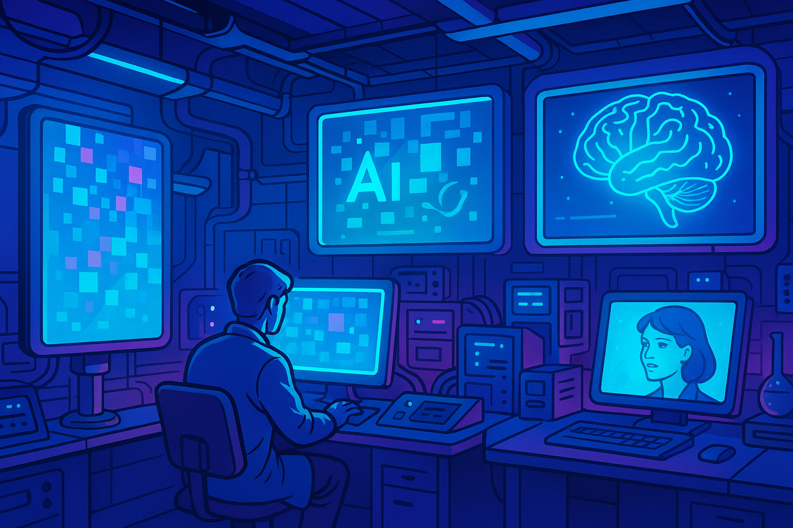
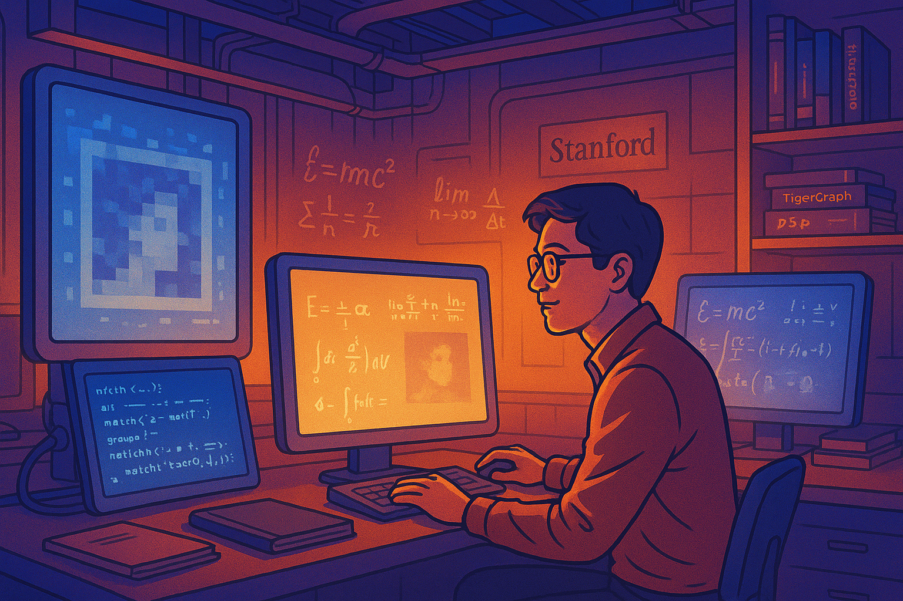
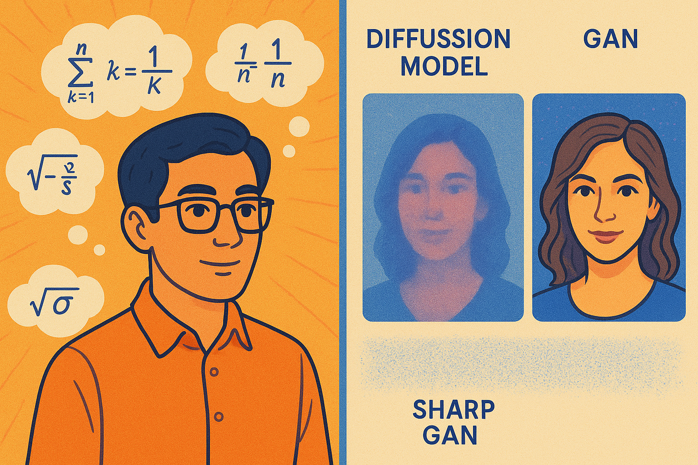
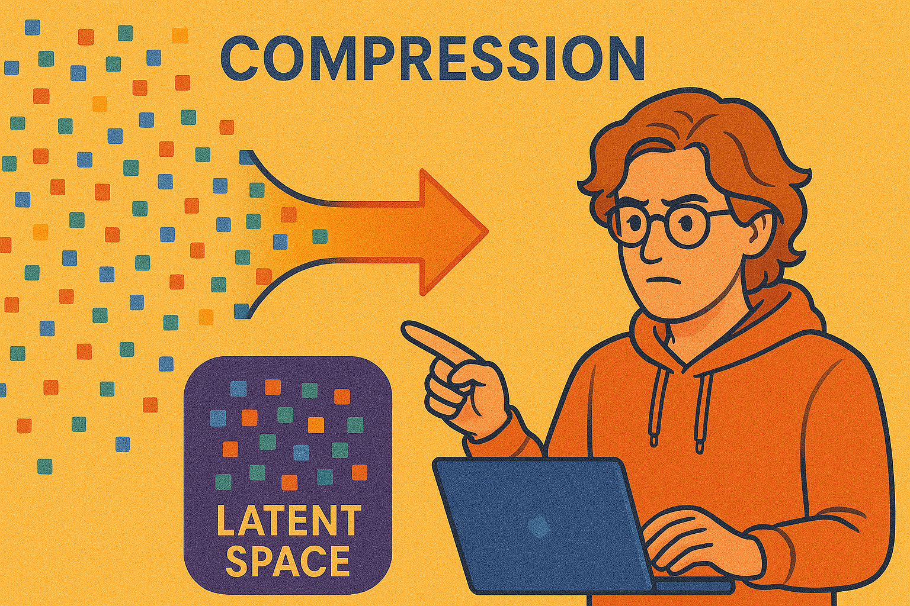
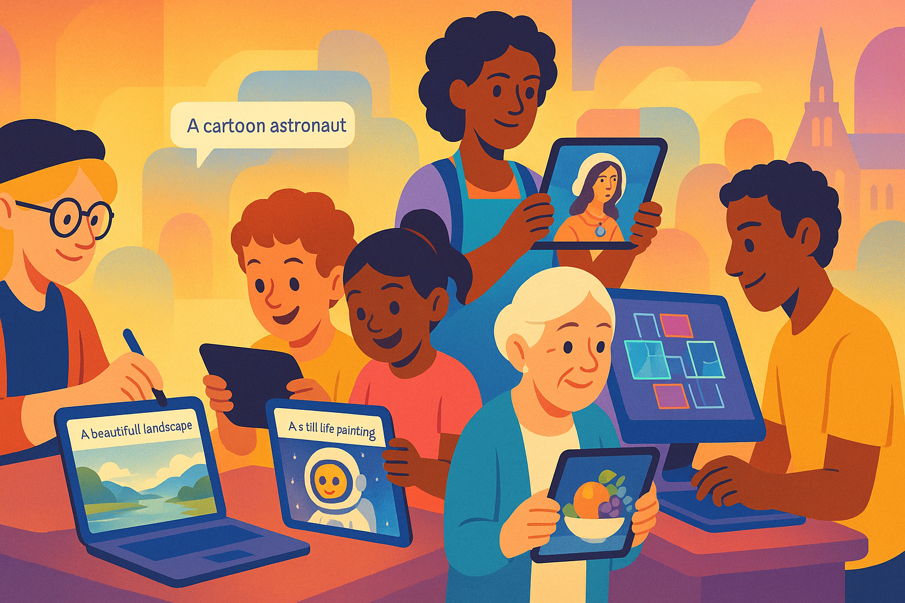
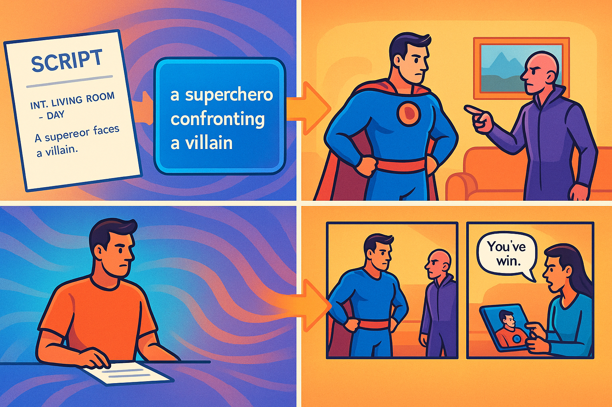
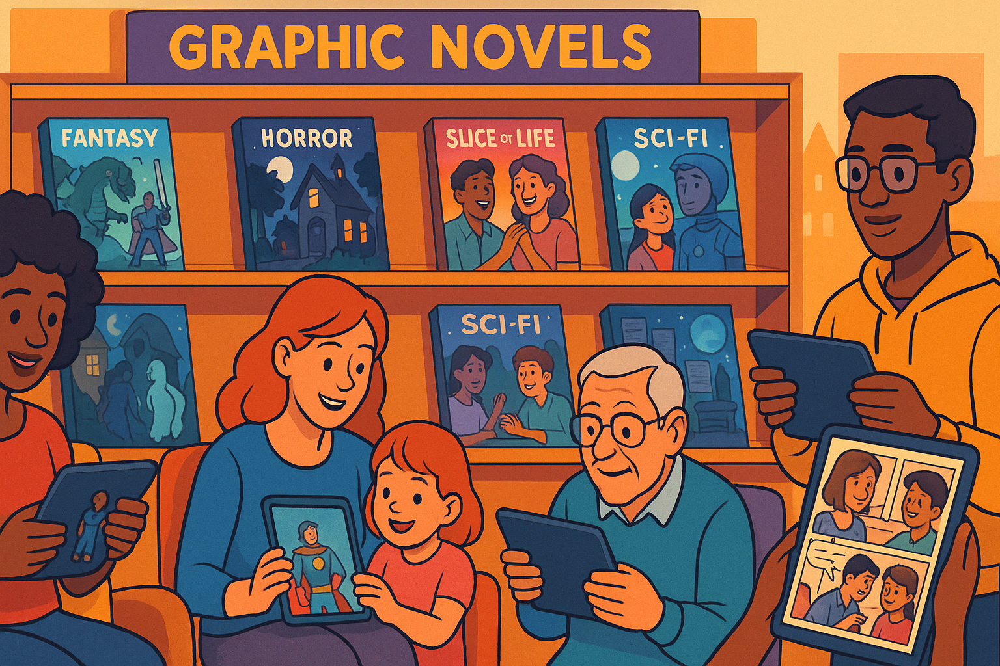
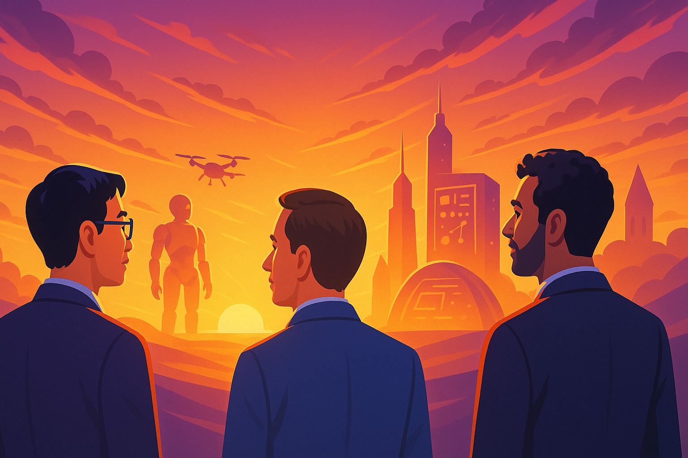
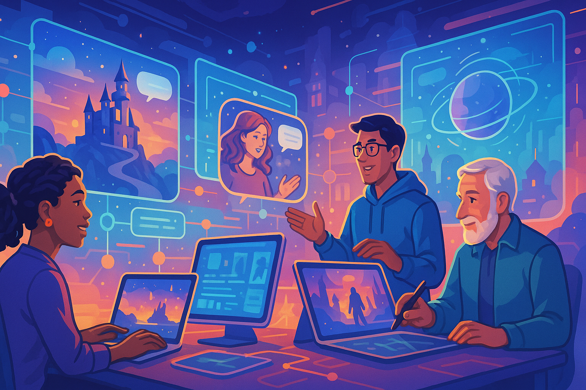

# Diffusion Dreams: The Epic Tale of Text-to-Image Revolution

  
Show Narrative Prompt

Please generate  a detailed, fun and entertaining story about the creation of text to image diffusion models.  Highlight the roles that Jonathan Ho, Robin Rombach, and Aditya Ramesh played in making these models useful for text to image generation tasks.

Describe the challenges each of these three people faced and how they overcame these obstacles to create a high-quality text to image applications.

Describe how an entire graphic novel can now be generated using these tools.

Our goal is to have you generate the full text of the story, but to turn the story into a graphic novel with many illustrations that explain how the text-to-image models were created.

When appropriate, suggest an image that could be inserted into the story to make the story a graphic novel. Describe each image in detail and be consistent across all the images in the story for style. When you describe an image, make sure to mention that it should be a colorful, bright wide-landscape drawing suitable for technology-forward optimistic graphic-novel.

## Prologue: The AI Art Renaissance

  
Show Image Prompt

1: A colorful, bright wide-landscape drawing showing a futuristic laboratory with multiple screens displaying abstract patterns transforming into recognizable images. The style should be optimistic tech-forward graphic novel art with glowing blue and purple hues suggesting AI technology.

In the not-so-distant past, computers could crunch numbers and process text, but creating beautiful, meaningful images from simple text descriptions remained in the realm of science fiction. The world of artificial intelligence was evolving rapidly, but the bridge between human language and visual creativity seemed an impossible chasm to cross.

This is the story of three visionaries who dared to dream differently – Jonathan Ho, Robin Rombach, and Aditya Ramesh – and how their revolutionary work transformed the impossible into the everyday, allowing machines to paint with words and unleashing a new creative revolution.

## Chapter 1: The Noise Whisperer - Jonathan Ho's Breakthrough

  
Show Image Prompt

Image 2
Please generate a new drawing.  It is a bright, colorful wide-landscape panel showing Jonathan Ho as a young researcher working late at night in a Stanford lab. Computer screens around him display mathematical equations and grainy images gradually becoming clearer. The art style should maintain the optimistic tech-forward aesthetic with warm lighting creating a sense of discovery.

Jonathan Ho stared at his computer screen, rubbing his tired eyes. For months, he had been grappling with a seemingly impossible problem: how to make diffusion models – a theoretically promising but practically useless approach to AI image generation – actually work.

"Everyone's betting on GANs," his colleague remarked, referring to the Generative Adversarial Networks that dominated the field. "Maybe we should too."

But Jonathan wasn't convinced. GANs had their limitations – they were notoriously unstable and difficult to train. There had to be another way.

The core idea behind diffusion models was elegantly simple: start with random noise and gradually transform it into a coherent image. It mimicked a natural process, like watching a photograph slowly develop in chemical solution. The problem was that existing approaches were painfully slow and produced blurry, disappointing results.

  
Show Image Prompt

Image 3:
Please generate a new drawing.
A split-panel wide-landscape illustration showing Jonathan with mathematical equations floating around him as if in thought bubbles, contrasted with early blurry diffusion model outputs versus sharp GAN outputs. The style should be bright and colorful with visual representations of the mathematical concepts.

"What if we approach the math differently?" Jonathan wondered. Instead of viewing the process as a complicated stochastic differential equation, what if they reframed it as a series of denoising steps? Each step would be simpler, more predictable.

For weeks, Jonathan and his team at UC Berkeley reformulated the equations, tested, failed, adjusted, and tested again. They were entering uncharted mathematical territory.

The breakthrough came in 2020. Jonathan's new approach – Denoising Diffusion Probabilistic Models (DDPM) – finally showed promise. Images generated by his system weren't just coherent; they were beginning to rival the quality of GANs while avoiding many of their pitfalls.

"We've done it," Jonathan said, watching as a clear image of a bird emerged from what had started as random static. "This changes everything."

Little did he know just how right he was. Jonathan's paper, "Denoising Diffusion Probabilistic Models," would become the foundation that others would build upon – the first crucial piece of the puzzle that would eventually enable machines to draw from our words.

## Chapter 2: The Efficiency Engineer - Robin Rombach's Compression Breakthrough

  
Show Image Prompt

Image 4: 
Please generate a new drawing.  A colorful wide-landscape panel showing Robin Rombach in a German university lab with servers and cooling systems. Visual indicators show excessive power consumption. Robin looks concerned while examining resource usage graphs. The tech-forward style should incorporate elements of European architecture in the background.

Meanwhile, across the ocean at LMU Munich in Germany, Robin Rombach faced a different challenge. By 2021, researchers were producing increasingly impressive results with diffusion models thanks to Jonathan Ho's breakthrough, but there was a massive problem: computational cost.

"At this rate, only the biggest tech companies with enormous data centers could ever use these models," Robin explained to his research partner Patrick Esser. "It takes too much computing power, too much memory, too much time."

The numbers were staggering. Training state-of-the-art diffusion models required hundreds of thousands of dollars in computing resources. Running them needed specialized hardware far beyond what any artist or designer could access. If diffusion models were to democratize AI art creation, something had to change.

  
Show Image Prompt

Image 5:
Please generate a new drawing.
A bright, colorful wide-landscape illustration showing Robin working with abstract visual representations of compression - data flowing from a large space into a smaller, dense "latent" space. The tech-forward style should use contrasting colors to show the before/after efficiency.

Robin's insight came from an unexpected direction: what if the diffusion process didn't need to work on full-sized images? What if they could compress images into a much smaller "latent" space first?

"It's like instead of cleaning every individual brick in a building, we work with a blueprint," Robin explained. "The blueprint contains all the essential information but is much smaller and easier to manipulate."

The mathematics were daunting. Robin and his team at the CompVis Lab needed to create a model that could compress images into this latent space without losing critical details, then run the diffusion process there, and finally decode the result back into a full image.

When their Latent Diffusion Model finally worked, the results were revolutionary. The computational requirements dropped dramatically – by orders of magnitude. What once required industrial-grade hardware could now potentially run on a decent laptop.

"We've opened the door," Robin said when their paper was published in 2022. "Now anyone can walk through it."

Robin's breakthrough would directly enable the creation of Stable Diffusion, the first open-source text-to-image model powerful enough to compete with commercial offerings while being accessible enough for widespread use.

## Chapter 3: The Language Whisperer - Aditya Ramesh Bridges Worlds
![](./

  
Show Image Prompt

Image 6:
Please generate a new drawing. A colorful wide-landscape panel showing Aditya Ramesh at OpenAI headquarters surrounded by both text documents and images, with visible connecting lines between words and visual elements. The tech-forward style should show abstract representations of language understanding with glowing connections.

While Jonathan Ho had made diffusion models viable, and Robin Rombach had made them efficient, there remained a critical missing piece: making these models understand and follow natural language instructions.

At OpenAI in San Francisco, Aditya Ramesh was tackling this exact problem. The challenge was enormous – human language is nuanced, contextual, and infinitely varied. How could a computer possibly understand what "a cat wearing a space helmet watching sunset on Mars" should look like?

"The gap between text and images is one of the most fundamental challenges in AI," Aditya explained to his team. "We need to build a bridge between these two worlds."
, a model trained on hundreds of millions of image-text pairs from the internet. CLIP learned to understand the relationship between visual concepts and language.

Then, they figured out how to use CLIP to guide diffusion models, effectively giving them "artistic direction" as they transformed noise into images. This guidance system allowed the models to understand increasingly complex prompts.

When DALL-E was first unveiled in January 2021, it shocked the world. Here was an AI that could create images from text descriptions with unprecedented accuracy and creativity. DALL-E 2, released in 2022, would push the boundaries even further.

"This isn't just about making pretty pictures," Aditya said. "It's about creating a new interface between human creativity and machine capabilities."

## Chapter 4: The Symphony Comes Together
 in separate locations but working on connected screens, with their innovations visually flowing together to create a complete system. The tech-forward style should use flowing light paths to show how their separate work connects.

By mid-2022, the stage was set for revolution. Jonathan Ho's mathematical framework made diffusion models work effectively. Robin Rombach's latent compression made them efficient enough for widespread use. And Aditya Ramesh's text understanding and guidance systems made them respond accurately to natural language.

When Stability AI released Stable Diffusion, built on Robin's latent diffusion approach, the final piece clicked into place. For the first time, a powerful text-to-image model was not just available to the public, but open source – anyone could download, use, modify, and build upon it.

The impact was immediate and tremendous. Overnight, designers, artists, writers, and everyday people gained access to an entirely new creative medium.

  
Show Image Prompt

9: Please generate a new drawing. A bright, colorful wide-landscape panel showing a diverse group of people using text-to-image tools on various devices: professional artists, children, elderly people, all creating different types of images. The tech-forward style should emphasize accessibility and diversity.

"What would have taken a professional artist hours or days can now be created in seconds," marveled a digital art director. "It's not replacing artists – it's giving them superpowers."

The three pioneers watched with amazement as their years of research transformed into tools used by millions. What had begun as theoretical computer science papers had become a new artistic medium accessible to all.

## Chapter 5: The Graphic Novel Revolution

  
Show Image Prompt

10: Please generate a new drawing. A colorful wide-landscape panel showing a writer/artist working with a text-to-image system to create comic panels. Multiple monitors show text prompts being transformed into sequential art. The tech-forward style should show a modern creative workspace with both traditional art tools and cutting-edge technology.

By 2023, creators began pushing the boundaries of what was possible with these new tools. Among the most exciting applications was the creation of entire graphic novels using text-to-image systems.

The process worked like a creative partnership between human and machine. Writers would craft their stories, describing each panel in natural language: "A cyberpunk detective stands on a neon-lit rooftop overlooking a rainy futuristic city, searching for clues with a holographic magnifying glass."

The diffusion model would generate the panel, which could then be refined with additional prompts or light editing. Artists could maintain a consistent style by including style descriptors in their prompts or by using techniques like "img2img" – where an existing image guides the creation of a new one, maintaining visual consistency.

  
Show Image Prompt

11: Please generate a new drawing. A bright, colorful wide-landscape panel showing a sequence of comic creation: script to text prompt to generated image to final panel with speech bubbles. The tech-forward style should emphasize the workflow from text to finished comic.

"What used to require a full production team – writer, penciler, inker, colorist – can now be accomplished by one or two people," explained a comic publisher. "It's democratizing sequential art creation in ways we never imagined possible."

The process wasn't without challenges. Maintaining character consistency across panels required careful prompting and occasional touch-ups. Complex action scenes needed thoughtful description. But the barriers to creating visual stories had never been lower.

Independent creators flourished in this new landscape. Stories that might never have been visualized due to budget constraints or lack of artistic connections could now come to life. Experimental graphic novels exploring unusual concepts found audiences. Written works were adapted into visual formats with unprecedented speed.

  
Show Image Prompt

12: Please generate a new drawing. A colorful wide-landscape panel showing a digital bookshelf with diverse graphic novels created using AI tools, with readers of all ages enjoying them on various devices. The tech-forward style should show the diversity of content and accessibility.

## Epilogue: The Continuing Revolution

  
Show Image Prompt

13: Please generate a new drawing. A bright, colorful wide-landscape panel showing Mr. Jonathan Ho, Mr. Robin Rombach, and Mr. Aditya Ramesh looking toward a sunrise/horizon with futuristic silhouettes representing future innovations. The tech-forward style should create an optimistic mood with warm colors and forward-looking imagery.

As for our three pioneers, they continue pushing the boundaries of what's possible. Jonathan Ho's mathematical insights have led to faster, more efficient diffusion processes. Robin Rombach's work on compression and efficiency has helped models run on increasingly accessible hardware. And Aditya Ramesh's advancements in connecting language and imagery have made models understand ever more nuanced instructions.

The text-to-image revolution they helped create continues to evolve at breakneck speed. New models emerge with improved capabilities: better understanding of physical laws, more accurate rendering of human anatomy, stronger adherence to compositional rules, and the ability to maintain consistency across multiple images.

"We're just seeing the beginning," Jonathan observes. "Think of early cinema – those first silent films with simple effects. We're at that stage with AI imagery. Imagine where we'll be in ten or twenty years."

Perhaps most importantly, these technologies are increasingly becoming tools for human expression rather than replacements for human creativity. They amplify our abilities, helping us visualize ideas that might otherwise remain trapped in our minds.

  
Show Image Prompt

14: Please generate a new drawing. A final colorful wide-landscape panel showing a diverse group of creators collaboratively using next-generation AI tools to build immersive visual stories and worlds. The tech-forward style should show futuristic interfaces and diverse applications beyond current capabilities.

"The most exciting developments aren't just technical improvements," says Aditya. "They're the unexpected ways people use these tools, combining them with other media and creating entirely new art forms."

As for graphic novels, they represent just one application of a technology that continues to find new uses – from conceptualizing architectural designs to visualizing scientific concepts, from creating educational materials to preserving cultural heritage through visual storytelling.

The story of text-to-image diffusion models is itself a testament to human ingenuity – how three researchers from different backgrounds and locations, each solving distinct parts of an enormous challenge, could collectively enable a creative revolution that empowers millions to turn their words into visual reality.

And like the best stories, this one is far from over. It's still being written – and illustrated – every day.

**THE END**