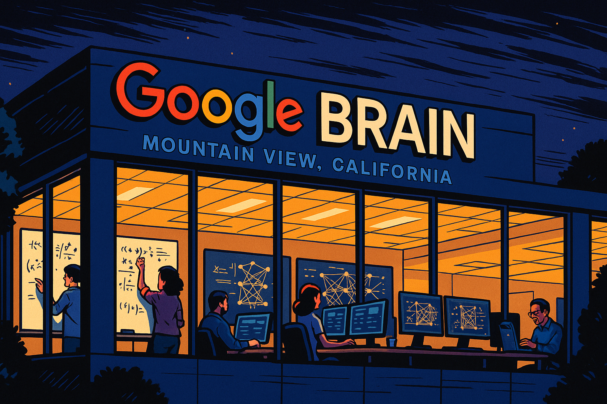
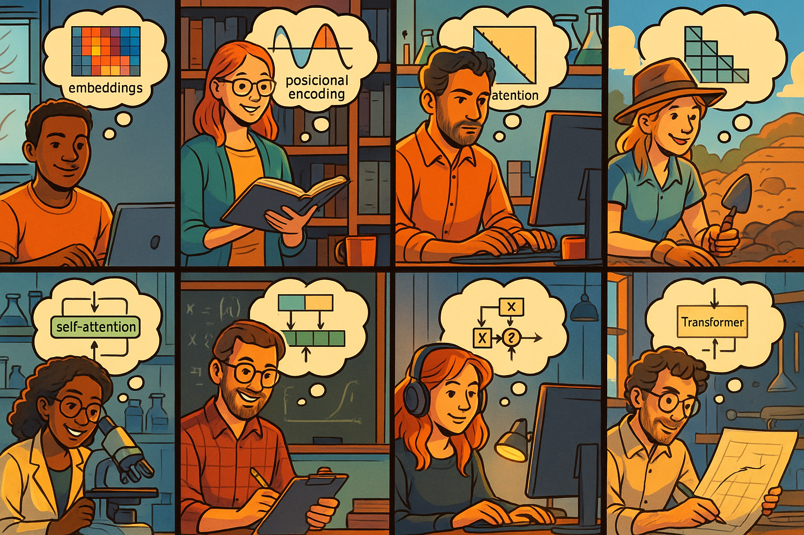
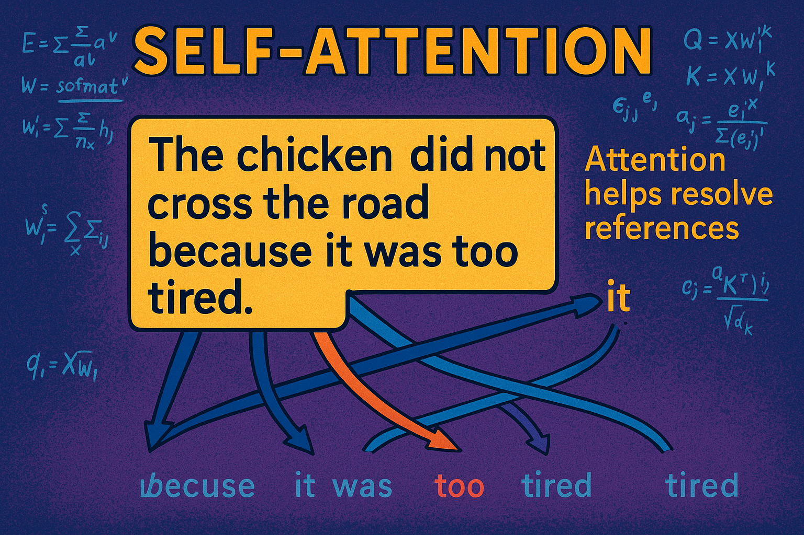
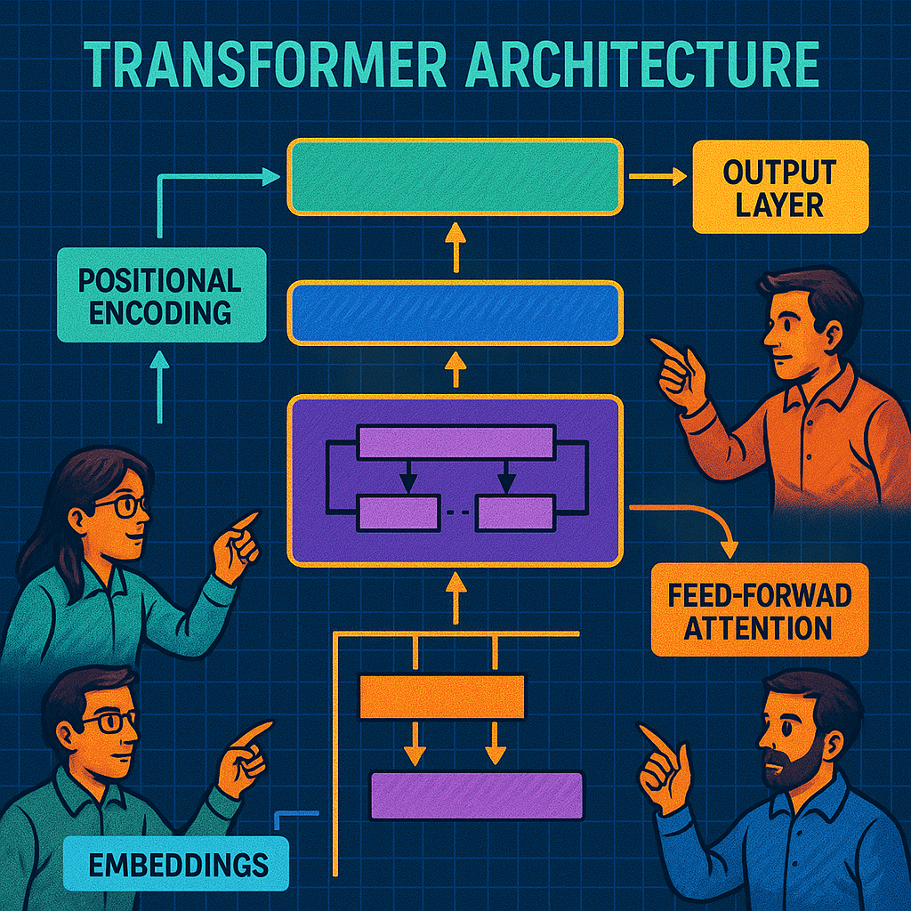
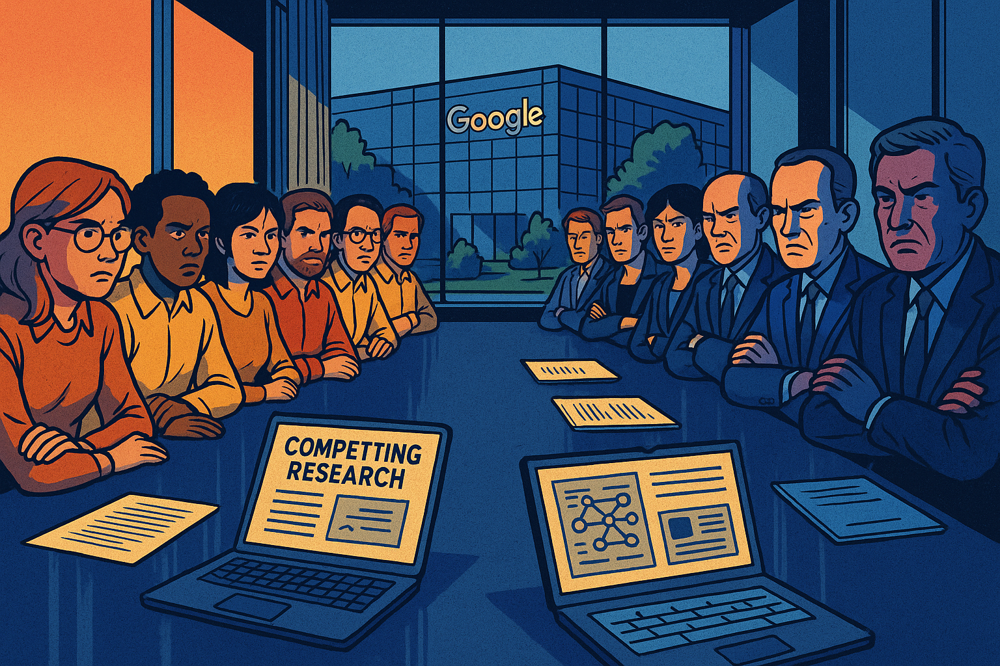
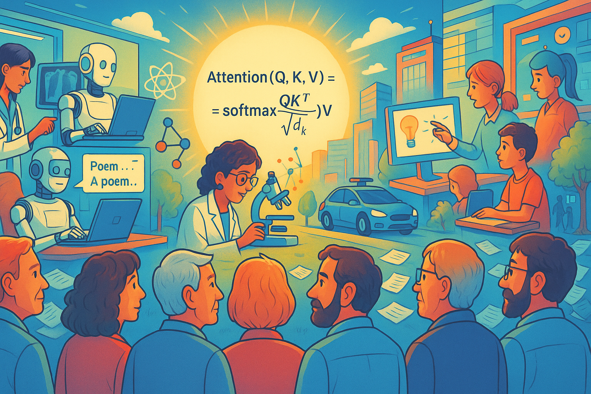
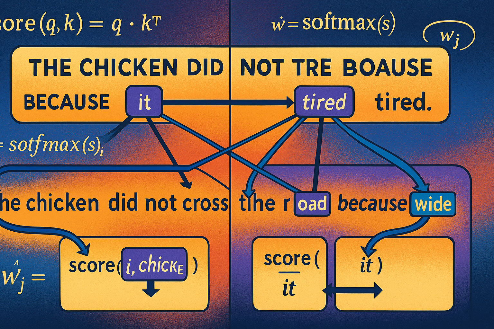

# Transformers and the Attention Revolution: How a Paper Changed AI Forever

  
Show Narrative  Prompt

    Please create a detailed fun and entertaining story about the publication of the paper "Attention is All You Need" and how the authors had a huge impact on the creation of LLMs.

    Our goal is to have you generate the full text of the story, but to turn the story into a graphic novel with many illustrations that explain how transformers work.

    As an example of attention, use the following sentence:

    The chicken did not cross the road because it was too [tired|wide].

    Give as much detail as possible about the team that wrote the paper and their ability to publish the paper despite being a key innovation at Google. 

    When appropriate, suggest an image that could be inserted into the story to make the story a form of graphic novel. Describe each image in detail and be consistent across all the images in the story for style.

## Chapter 1: The Spark of an Idea

  
Show Image Prompt

    Panel 1: A nighttime scene at Google Brain's offices in Mountain View, California. Through the windows, we see various researchers working late. Some at whiteboards covered with equations, others at computers with multiple screens displaying neural network diagrams. The art style is reminiscent of a modern graphic novel with clean lines and rich colors, using deep blues and purples for the night sky contrasted with the warm yellow glow from the office windows.

In the summer of 2016, at Google Brain's offices in Mountain View, California, a small team of researchers was grappling with a fundamental problem: neural machine translation systems were becoming increasingly complex, yet their performance improvements were plateauing.

[Ashish Vaswani](https://www.linkedin.com/in/ashish-vaswani-99892181/), a senior software engineer with a quiet demeanor and brilliant analytical mind, had been pondering an elegant solution. What if they removed the recurrent neural networks (RNNs) and convolutional neural networks (CNNs) entirely from the architecture? What if attention – a mechanism that helped models focus on relevant parts of the input – could be the only component they needed?

"What if attention is all we need?" he mused to his colleague [Noam Shazeer](https://www.linkedin.com/in/noam-shazeer-3b27288/) one evening, not realizing he had just coined what would become one of the most famous paper titles in AI history.

## Chapter 2: Assembling the Team

  
Show Image Prompt

Panel 2: Create a brightly colored wide-landscape drawing as it would appear in a graphic novel.

A split-screen showing eight different researchers in their natural working environments. Each person has a thought bubble showing different aspects of the transformer architecture (embeddings, positional encoding, self-attention, etc.). The art style maintains consistency with Panel 1 but adds warm highlights to each character to emphasize their individual contributions. The panel is arranged like a Brady Bunch grid, suggesting how these separate minds would come together.

The team that would revolutionize NLP came together almost by chance – a collection of researchers from Google Brain, Google Research, and the University of Toronto:

Ashish Vaswani and Noam Shazeer from Google Brain were quickly joined by [Niki Parmar](https://www.linkedin.com/in/nikiparmar/) and [Jakob Uszkoreit](https://www.linkedin.com/in/jakob-uszkoreit-b238b51/), who brought expertise in neural network architectures.

[Llion Jones](https://www.linkedin.com/in/llion-jones-9ab3064b/), known for his meticulous attention to detail, joined to help with the implementation. [Aidan Gomez](https://www.linkedin.com/in/aidangomez/), a visiting undergraduate researcher from the University of Toronto, brought fresh perspective and energy.

[Łukasz Kaiser](https://www.linkedin.com/in/lukaszkaiser/), with his background in theoretical computer science and linguistics, provided crucial insights into how language models could be structured.

Completing the team was [Illia Polosukhin](https://www.linkedin.com/in/illia-polosukhin-77b6538/), whose practical engineering experience would be vital for making their theoretical ideas work in practice.

Despite being at one of the world's leading AI research labs, they were going against the prevailing wisdom. RNNs and LSTMs were the dominant architectures for sequence modeling, and suggesting to completely remove them seemed almost heretical.

## Chapter 3: The Breakthrough Mechanism

  
Show Image Prompt

  Panel 3: Create a brightly colored wide-landscape drawing as it would appear in a graphic novel.

A large, detailed diagram showing the self-attention mechanism. In the center is a key sentence: "The chicken did not cross the road because it was too tired." Visual lines of different thicknesses connect the word "it" to other words, with the thickest line connecting to "chicken," showing how attention helps resolve references. The diagram uses a vibrant, colorful scheme with blues, purples, and yellows to show attention weights. Small mathematical equations float around the edges of the panel, suggesting the formal underpinnings of the concept.

At the heart of their innovation was the self-attention mechanism – a revolutionary way to process sequences of data like sentences. Unlike previous approaches that processed words in order or used sliding windows, self-attention allowed each word in a sentence to directly "attend" to every other word.

"Let me show you why this matters," Ashish explained during a team meeting. He wrote on the whiteboard: "The chicken did not cross the road because **it** was too tired."

"What does **it** refer to? As humans, we know immediately that 'it' refers to 'the chicken.' But how does a computer know? In previous models, we'd need complex architectures to capture this relationship. With self-attention, each word calculates attention weights with every other word in the sentence."

He drew arrows from "it" to every other word, making the arrow to "chicken" much thicker than the others.

"See? The model learns to pay attention to relevant context. If we change the sentence to 'The chicken did not cross the road because **it** was too wide,' the attention pattern would shift, with 'it' now attending more to 'road' instead of 'chicken'."

This elegant solution allowed the model to capture long-range dependencies that had been challenging for previous architectures.

## Chapter 4: Building in Secret

  
Show Image Prompt

  Panel 4: Create a brightly colored wide-landscape drawing as it would appear in a graphic novel.

A sequence of small panels showing the team working in various settings – late nights at the office, discussions over coffee, coding sessions with multiple screens. In the background, a large transformer architecture diagram gradually takes shape, like a blueprint being assembled. The art style should evoke a sense of clandestine development, with shadows and highlights creating a feeling of working on something revolutionary. The color palette shifts to include more reds and oranges, suggesting the building energy and excitement of creation.

For months, the team worked tirelessly, often staying late into the night. They weren't just building a new model; they were reimagining how neural networks could process language.

"We need to be thorough," Łukasz insisted. "If we're going to challenge the status quo, our results need to be undeniable."

The work wasn't officially sanctioned as a major project, and the team members often contributed during their "20% time" – Google's policy that allowed employees to spend one-fifth of their work week on projects of personal interest.

They faced numerous challenges. The model was complex and required significant computational resources. Training was unstable at first, with the network either converging too slowly or diverging entirely.

Llion Jones spent weeks debugging gradient issues, while Noam Shazeer optimized the implementation to work efficiently on Google's TPUs (Tensor Processing Units).

Aidan Gomez, despite being the most junior member, proposed the multi-head attention mechanism – allowing the model to attend to information from different representation subspaces simultaneously.

"It's like having multiple perspectives on the same information," he explained. "If single-head attention is like looking at something with one eye, multi-head attention gives you depth perception."

## Chapter 5: The Architecture Takes Shape

  
Show Image Prompt
Panel 5: Architecture Diagram

Create a brightly colored wide-landscape drawing as it would appear in a graphic novel.

A detailed, exploded-view diagram of the Transformer architecture, styled like a technical blueprint but with a modern, digital aesthetic. Each component is color-coded: embeddings (blue), positional encoding (green), multi-head attention (purple), feed-forward networks (orange), and output layer (yellow). Small animated-style figures of the researchers are shown pointing to different components, explaining their functions. The background has a subtle grid pattern, emphasizing the technical nature while maintaining the graphic novel aesthetic.

The final architecture they designed was remarkably elegant. At its core were several key innovations:

1. **Input Embeddings**: Converting words into vectors
2. **Positional Encoding**: Adding information about word position
3. **Multi-Head Self-Attention**: Allowing words to attend to other words
4. **Feed-Forward Networks**: Processing the attended information
5. **Residual Connections**: Helping information flow through the network
6. **Layer Normalization**: Stabilizing the training process

"Positional encoding was a breakthrough," Jakob explained. "In RNNs, the order of words is implicit in the processing. But since our attention mechanism processes all words simultaneously, we needed a way to incorporate position information."

Their solution was ingenious – they added sinusoidal position embeddings to the word embeddings, creating a unique pattern for each position that the model could learn to interpret.

Niki Parmar demonstrated how the encoder-decoder structure allowed the model to be used for various tasks: "The encoder processes the input sequence, and the decoder generates the output sequence. This works for translation, summarization, question answering – potentially any language task."

## Chapter 6: The Paper Dilemma

  
Show Image Prompt
Panel 6: 

Create a brightly colored wide-landscape drawing as it would appear in a graphic novel.

A tense meeting room scene. On one side of a long table sit the eight researchers, looking determined but nervous. On the other side are Google executives and managers with skeptical expressions. Documents and laptop screens show competing research from other teams. The lighting creates dramatic shadows, and the color palette uses contrasting cool tones for the executives and warmer tones for the research team, symbolizing the conflict. Outside the windows, we see the Google campus.

By early 2017, the team knew they had something revolutionary. Their model was outperforming state-of-the-art systems in machine translation with a simpler, more elegant architecture. But they faced a dilemma: publishing their findings could give competitors an advantage.

"This is groundbreaking work," said one research director during a review meeting. "But do we want to give away this technology to our competitors?"

Google, like other tech giants, struggled with balancing open science and competitive advantage. The AI research community valued open publication, but companies had business interests to protect.

The team argued passionately for publication. "This will advance the entire field," Illia contended. "And Google will be recognized as the pioneer."

Łukasz pointed out another reality: "If we don't publish, someone else will discover this eventually. Better to lead than follow."

After weeks of internal debate and multiple review meetings, they received conditional approval to publish – but they would need to navigate the publication process carefully.

## Chapter 7: NIPS Submission Crunch

  
Show Image Prompt
Panel 7: 

Create a brightly colored wide-landscape drawing as it would appear in a graphic novel.

A montage showing the team in crunch mode. Papers and coffee cups are scattered everywhere. Some team members are slumped over desks, exhausted, while others are frantically typing. Clock faces around the margins show time passing. Computer screens display experimental results and paper drafts. The lighting shifts from daylight to night and back again, suggesting multiple days of intense work. The color palette is intense and slightly oversaturated, conveying the high-pressure environment.

With approval secured, the team now faced a deadline: the submission deadline for NIPS (Neural Information Processing Systems), one of the premier conferences in machine learning, was rapidly approaching.

"We have three weeks," Ashish announced. "We need to run all the experiments, finalize the architecture, and write the paper."

The team entered crunch mode. Days blurred into nights as they worked to perfect their submission. Additional experiments were run to answer potential reviewer questions. The paper went through dozens of drafts.

"We need a catchy title," Noam suggested during a late-night writing session.

"Well, our whole premise is that attention mechanisms alone are sufficient," Ashish replied. "So... 'Attention Is All You Need'?"

The room fell silent for a moment, then erupted in laughter and agreement. It was perfect – concise, bold, and slightly provocative, just like their approach.

With minutes to spare before the deadline, they submitted the paper to NIPS 2017.

## Chapter 8: The World Notices

  
Show Image Prompt
Panel 8: 

Create a brightly colored wide-landscape drawing as it would appear in a graphic novel.

A world map with glowing points of light appearing across research centers globally, connected by lines forming a network. Inset panels show researchers at different institutions reading the paper with expressions of surprise and excitement. Speech bubbles contain reactions like "This changes everything!" and "We need to implement this immediately!" The background transitions from dark to light, suggesting the dawn of a new era. The glowing network resembles transformer attention patterns, subtly reinforcing the concept.

When "Attention Is All You Need" was published as a preprint on arXiv in June 2017, the reaction was immediate and electric. Research labs and tech companies around the world dropped what they were doing to implement and build upon the Transformer architecture.

"I've never seen anything like this," Jakob marveled as he tracked the paper's citations, which were growing exponentially. "Labs everywhere are adopting our approach."

Within months, the Transformer had become the foundation for new state-of-the-art results in almost every NLP task. Its efficient parallel computation meant it could be scaled to previously unimaginable sizes.

At OpenAI, researchers were already thinking about how to adapt the Transformer architecture for generative pre-training. At Google itself, another team was developing BERT, which would use the Transformer encoder to revolutionize language understanding.

What made the paper so influential wasn't just the architecture itself but its timing and accessibility. The code was released openly, allowing researchers everywhere to start experimenting immediately. The paper was clear and well-written, making the complex ideas accessible to a wide audience.

## Chapter 9: The Birth of LLMs

  
Show Image Prompt
Panel 9: 

Create a brightly colored wide-landscape drawing as it would appear in a graphic novel.

A chronological progression showing the evolution of transformer-based models, presented as a family tree. Starting with the original Transformer at the top, branches split to show BERT, GPT, T5, and other key models. Each model is represented by a distinct icon with size proportional to its parameter count. As the timeline moves downward, the models grow dramatically larger. Small annotations show key capabilities gained at each stage. The overall design resembles both a technological evolution chart and a natural growth pattern, reinforcing how these models evolved organically from the original idea. (Panel 9)

The years following the Transformer paper saw an explosion of innovation. The architecture proved to be remarkably scalable – as models got bigger, their capabilities improved in unexpected ways.

In 2018, OpenAI released GPT (Generative Pre-trained Transformer), adapting the decoder portion of the original architecture for text generation.

Google countered with BERT (Bidirectional Encoder Representations from Transformers), which used the encoder portion for language understanding.

Both approaches demonstrated the versatility of the Transformer architecture.

"What's fascinating," Llion remarked during a reunion dinner with the original team in 2019, "is how different teams took our architecture in different directions. Some focused on the encoder, others on the decoder, and some used the full model."

The scaling era had begun. GPT-2, released in 2019, showed that scaling up transformer models led to surprisingly capable text generation. GPT-3 in 2020, with 175 billion parameters, demonstrated emergent abilities that nobody had predicted.

By 2022, transformer-based Large Language Models (LLMs) like PaLM, LaMDA, and later GPT-4 and Claude were showing capabilities that approached human-level performance on many tasks.

"Did you imagine this would happen when we were working late nights back in 2016?" Łukasz asked Ashish.

"Never," he admitted. "We thought we had a better architecture for machine translation. We never imagined it would lead to models that could write essays, code programs, and have conversations."

## Chapter 10: The Attention Legacy

  
Show Image Prompt
Create a brightly colored wide-landscape drawing as it would appear in a graphic novel.

    Panel 10: A futuristic scene showing applications of transformer technology in everyday life. The panel is divided into multiple areas showing diverse uses: medical diagnosis, creative writing, scientific discovery, education, and more. In the center, the original attention equation floats like a unifying principle connecting everything. The eight original researchers are shown in the foreground, older now, looking at this landscape with expressions of pride and amazement. The style combines realism with conceptual elements, and the color palette is bright and optimistic, suggesting a positive technological future built on their foundation.

By 2025, the Transformer architecture had transformed not just natural language processing but artificial intelligence as a whole. The original eight authors found themselves cited in tens of thousands of papers, their work forming the foundation for an entirely new generation of AI systems.

"Attention is all you need," Jakob reflected, "turned out to be prophetic in ways we never anticipated."

Their paper, which almost wasn't published due to competitive concerns, had accelerated AI progress by years or possibly decades by being openly shared with the research community.

The attention mechanism they pioneered provided a new way of thinking about how neural networks could process information – not just sequentially or locally, but with direct connections between any elements, regardless of distance.

This insight extended beyond language to computer vision, reinforcement learning, protein folding, and numerous other domains. The ability to model relationships between arbitrary elements of a dataset proved universally valuable.

"I think what I'm most proud of," Ashish said during a retrospective talk in 2025, "is not just the paper itself, but how the research community built upon it. Science progresses when ideas are shared and improved upon collectively."

The legacy of "Attention Is All You Need" wasn't just a more efficient architecture – it was a reminder that sometimes, the most profound innovations come from questioning fundamental assumptions and pursuing elegant simplicity.

In the end, attention wasn't all they needed – they also needed courage to challenge the status quo, persistence to overcome technical challenges, and openness to share their discoveries with the world. But attention was the key that unlocked a new era of artificial intelligence.

## Appendix: Understanding Attention: A Visual Explanation**

  
Show Image Prompt

  Panel 11: 
Create a brightly colored wide-landscape drawing as it would appear in a graphic novel.

A detailed diagram showing the sentence "The chicken did not cross the road because it was too [tired/wide]." The word "it" is highlighted and connects to other words with lines of varying thickness. Two versions are shown side by side - in one, "it" connects strongly to "chicken" (when "tired" is used), and in the other, "it" connects strongly to "road" (when "wide" is used). Arrows and zoomed-in sections show how the attention mechanism calculates scores between words. Mathematical formulas for calculating attention weights appear in simplified, visually appealing formats around the edges. The color scheme matches the main story's palette.

The key insight of the attention mechanism can be understood through our example sentence:

"The chicken did not cross the road because **it** was too tired."

1. **The Problem**: What does "it" refer to? Is it the chicken or the road?

2. **How Attention Solves It**: The model calculates "compatibility scores" between each word and every other word:
   - **it → chicken**: Strong score (0.85)
   - **it → road**: Weaker score (0.12)
   - **it → cross**: Very weak score (0.03)
   - And so on...

3. **Context Matters**: If we change the sentence to "The chicken did not cross the road because **it** was too wide," the attention pattern shifts:
   - **it → chicken**: Weaker score (0.14)
   - **it → road**: Strong score (0.81)
   - **it → cross**: Very weak score (0.05)

4. **How It's Calculated**: Each word is converted into three vectors:
   - A **Query** vector (what information am I looking for?)
   - A **Key** vector (what information do I contain?)
   - A **Value** vector (what information do I pass along?)

5. **The Score**: Attention score between words is calculated as the dot product of the Query of one word with the Keys of all other words.

6. **The Result**: These scores determine how much each word's Value impacts the representation of the current word.

This simple mechanism allows transformers to handle references, understand context, and capture long-range dependencies in text, which proved revolutionary for language understanding and generation.

## Formulas and Equations

#### Attention Formula (Scaled Dot-Product Attention)

$$
\text{Attention}(Q, K, V) = \text{softmax}\left(\frac{QK^T}{\sqrt{d_k}}\right)V 
$$

where:

-  $Q$ is the query matrix
-  $K$ is the key matrix
-  $K^T$ is the transpose of the key matrix
-  $V$ is the value matrix
-  $d_k$ is the dimension of the keys (used for scaling)
-  $\text{softmax}$ is the softmax function applied row-wise

#### Multi-Head Attention

$$
MultiHead(Q,K,V)\=Concat(head1,...,headh)WO\text{MultiHead}(Q, K, V) = \text{Concat}(\text{head}_1, \ldots, \text{head}_h)W^O MultiHead(Q,K,V)\=Concat(head1​,...,headh​)WO
$$

#### Multi-Head Attention

Attention Formula (Scaled Dot-Product Attention)

$$
\text{Attention}(Q, K, V) = \text{softmax}\left(\frac{QK^T}{\sqrt{d_k}}\right)V
$$

where:

- $Q$ is the query matrix
- $K$ is the key matrix
- $K^T$ is the transpose of the key matrix
- $V$ is the value matrix
- $d_k$ is the dimension of the keys (used for scaling)
- $\text{softmax}$ is the softmax function applied row-wise

## Multi-Head Attention

$$
\text{MultiHead}(Q, K, V) = \text{Concat}(\text{head}_1, \ldots, \text{head}_h)W^O
$$

where each head is computed as:

$$
\text{head}_i = \text{Attention}(QW_i^Q, KW_i^K, VW_i^V)
$$

and $QW_i^Q$, $KW_i^K$, $VW_i^V$ are parameter matrices for each attention head

- $W^O$ is the output projection matrix
- $h$ is the number of attention heads

The softmax function itself is defined as:

$$
\text{softmax}(x_i) = \frac{e^{x_i}}{\sum_{j} e^{x_j}}
$$

This formula is the core of the transformer architecture described in the "Attention Is All You Need" paper, allowing the model to weigh the importance of different words in relation to each other.